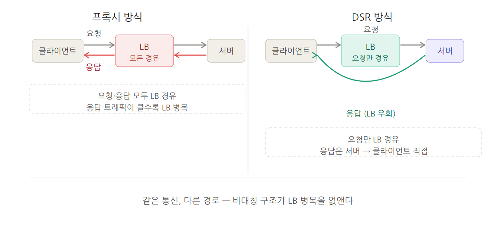
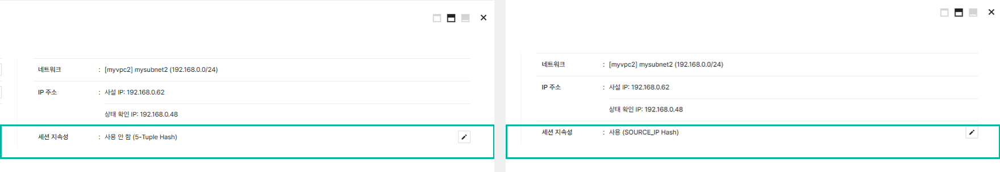
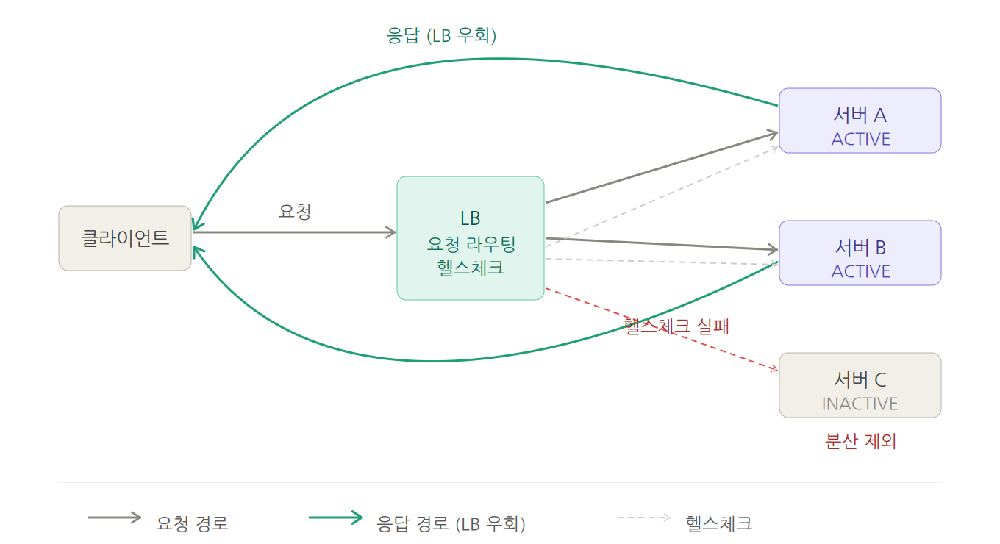
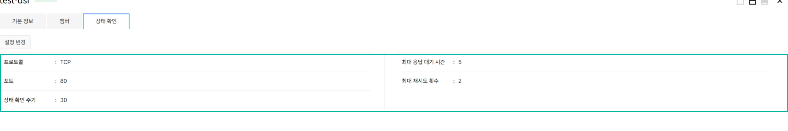

# 경계가 만든 길, Load Balancer(DSR)

---

평소처럼 서버 모니터링 대시보드를 열었다. 지표는 평온했다. 요청도, CPU도, 별다른 이상이 없었다. 그런데 LB의 트래픽 그래프가 달랐다. 접속자가 늘수록 LB의 처리량이 함께 올라가고 있었다.

접속자의 수가 증가할수록 LB의 처리량은 선형으로 치솟았다. 기존의 프록시 방식 LB는 클라이언트와 서버 사이에서 양쪽 연결을 모두 종단하고 데이터를 중계하는 구조였다. 요청이 작아도 응답이 큰 서비스라면, 그 응답 트래픽 전부가 LB를 통과했다. 1KB 요청에 100MB 응답이 나가는 워크로드라면 LB 대역폭을 응답이 다 잡아먹는 셈이었다. 100명일 때 초당 6천 회, 1,000명이 되면 6만 회. 그 수치는 가파르게 올라갔다.

백엔드 서버를 아무리 늘려도 LB 자체가 처리량의 상한이 되는 구조였다. 물론 기존의 프록시 방식은 L7 라우팅, SSL 종단이 필요한 표준 웹 서비스에서는 효율적이었다. 하지만 응답 트래픽이 크거나 낮은 레이턴시가 중요한 워크로드에서는 구조적인 한계가 분명했다.

어떻게 하면 이 한계에서 벗어날 수 있을까? 응답 트래픽을 LB에서 분리해, 서버가 클라이언트에게 직접 응답하게 되면 이 병목을 근본적으로 제거할 수 있겠다고 생각했다. 그것이 출발점이었다.

---

## 선 긋기

설계 초기에 가장 먼저 정한 건 **선**이었다. 요청은 LB를 경유하되, 응답은 LB를 우회한다. 이 선이 이후 모든 결정의 기준이 됐다. IP는 그대로 두고 L2 레벨에서 목적지만 바꿔 서버로 전달하기 때문에 SNAT/DNAT가 없고, 서버에서 클라이언트 원본 IP를 그대로 볼 수 있다. 기존 프록시 방식에서 당연하게 써야 했던 X-Forwarded-For나 Proxy Protocol이 더 이상 필요 없었다.

세션 분산은 5-tuple 기반이 기본이고, 세션 지속성을 켜면 소스 IP 기반으로 바뀐다. 로그인 세션처럼 동일 서버에 고정이 필요한 서비스라면 이 옵션을 선택하면 된다.

*세션 지속성 설정: 사용 안 함 (5-Tuple Hash) vs 사용 (SOURCE_IP Hash)*

하지만 선을 그은 만큼 그 값을 치러야 했다. LB를 우회하려면 서버가 VIP를 자신의 주소로 인식해야 한다. lo 인터페이스에 VIP를 /32로 바인딩하고 ARP 충돌 방지 커널 파라미터(arp_ignore=1, arp_announce=2)를 설정해야 한다. 이 부담을 최소화하는 운영 가이드를 만드는 것도 설계의 일부였다.

---

## 제약 안에서의 설계

커널 앞단에서 패킷을 처리하기로 선택하면서 익숙하던 자유도를 내려놓아야 했다. 동적 자료구조를 쓸 수 없고, 코드를 커널에 올릴 때 모든 실행 경로의 안전성을 정적으로 증명해야 한다. 그리고 빠뜨린 경계 검사 하나에 로드가 거부되었다.

거기서 끝이 아니었다. instruction 수 제한이 있어 복잡한 처리를 쪼개야 했고, 헬스체크 probe 송신처럼 능동적으로 패킷을 생성하는 작업은 커널 앞단에서 할 수 없었다.

결국 방식을 바꿨다. 제약에 맞서지 않고 그 안에서 설계하기로 했다. 무거운 계산과 능동적인 처리는 애플리케이션 레이어가 맡고, 커널 앞단은 빠른 조회만 하도록 역할을 나눴다. 역할을 나누고 나니 구조가 오히려 명확해졌다. 제약이 오히려 데이터 경로를 단순하게 유지하도록 강제했다. 초반에 불편하던 것이 나중에는 **설계 원칙**이 됐다.

---

## 조용히 동작하는 것들

완성된 구조는 단순하다. 클라이언트의 요청은 LB를 경유해 서버로 향한다. 서버의 응답은 LB를 거치지 않고 클라이언트에게 곧장 닿는다. 사이가 있는 것도, 없는 것도 아닌 구조다. 요청 경로에만 LB가 존재하고, **응답 경로에는 없다.**

멤버 상태는 ICMP, TCP, HTTP로 주기적으로 점검한다.

*헬스체크 설정 화면 — 프로토콜, 주기, 응답 대기 시간, 재시도 횟수 설정*

장애가 감지된 서버는 자동으로 분산 대상에서 제외되고, 복구되면 다시 포함된다. 여러 노드가 동시에 트래픽을 처리하는 Active-Active 구조라, 한 노드에 문제가 생겨도 다른 노드가 이어받는다. Floating IP를 연결하면 외부 네트워크에서도 즉시 접근할 수 있다.

---

## 두 가지 선택지가 생겼다

서비스 릴리스 후 다시 대시보드를 열었다. 지표는 평온했다. 요청도, CPU도, LB도 별다른 이상이 없었다. 접속자가 늘어도 LB의 처리량은 움직이지 않았다.

Load Balancer(DSR)은 기존 LB를 대체하지 않는다. L4(TCP, UDP)만 지원하며, L7 라우팅이나 SSL 종단이 필요한 곳엔 프록시 방식이 맞다. Load Balancer(DSR)은 그 구조가 불필요한 곳, 응답이 크거나 낮은 레이턴시와 원본 IP 투명성이 중요한 곳을 위한 다른 선택지다. 미디어 스트리밍, 대용량 파일 다운로드, 게임처럼 응답 트래픽이 큰 서비스라면 Load Balancer(DSR)이 구조적으로 더 맞다. 클라이언트 원본 IP를 서버에서 직접 봐야 하는 서비스라면, 별도 헤더 파싱 없이 바로 활용할 수 있다. 프로젝트당 DSR 10개, DSR당 멤버 30개까지 사용할 수 있다.

커널 단 기술을 실제 상용 네트워크 제품에 녹여, 프록시 방식 대비 처리 성능을 높였다. 두 옵션을 상황에 맞게 선택할 수 있게 됐다는 것이 이 프로젝트의 본질이다. Load Balancer(DSR)은 지금도 트래픽을 나누고 있지만 아직 완성형은 아니다. 운영 가시성을 높이는 작업이 남아 있다. 경계는 한 번 긋는 것으로 끝나지 않는다.

* [Load Balancer(DSR) 서비스 소개](https://www.nhncloud.com/kr/service/network/load-balancer-dsr)
* [Load Balancer(DSR) 콘솔 사용 가이드](https://docs.nhncloud.com/ko/Network/Load%20Balancer(DSR)/ko/console-guide/)
* 도입 문의: [NHN Cloud 고객지원 > 문의하기](https://www.nhncloud.com/kr/support/inquiry)

---

## 참고 용어

**XDP(eXpress Data Path):** 커널 앞단에서 패킷을 처리하는 고성능 기술. DSR의 데이터플레인 핵심입니다.

**eBPF(extended Berkeley Packet Filter):** 커널에서 안전하게 실행되는 프로그램 작성 기술. XDP 구현의 기반입니다.

**VXLAN(Virtual Extensible LAN):** L2를 L3 위에서 캡슐화하는 터널링 프로토콜. LB가 멤버로 패킷을 전달할 때 사용됩니다.

**일관성 해싱(Consistent Hashing):** 노드 변경 시 기존 세션 재배치를 최소화하는 분산 알고리즘. Active-Active 구조의 기반입니다.

**BPF MAP:** eBPF 프로그램의 데이터 저장·조회 자료구조. 세션·멤버·분산 테이블을 관리합니다.

**Control Plane / Data Plane:** 제어(정책 결정, 헬스체크)와 전달(패킷 처리) 역할의 분리 구조. 데이터 경로를 단순하고 빠르게 유지합니다.
