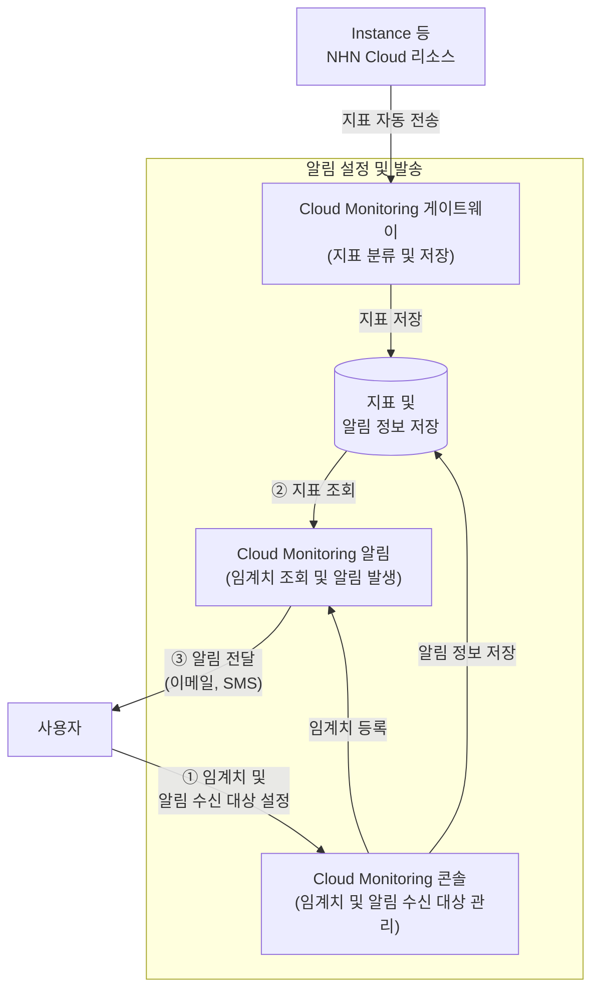

# Cloud Monitoring에서 임계치 기반 알림 설정하기

## 시작하기 전에

Cloud Monitoring은 인스턴스를 비롯한 NHN Cloud 리소스의 시스템 및 서비스 지표를 자동으로 수집하고 알림을 제공하는 서비스입니다. 대시보드와 차트를 생성해 실시간으로 지표를 조회할 수 있으며, 임계치를 설정해 이를 초과한 지표에 대한 알림을 이메일, SMS 등으로 전파할 수 있습니다. Prometheus 호환 지표 형태 조회와 HTTP API를 제공하므로 외부 시스템과 연동할 수 있으며, 장애가 발생하기 전에 이상 징후를 사전 탐지하는 데 활용할 수 있습니다.

여기에서는 인스턴스의 CPU 사용률에 임계치 기반 알림을 설정하고, 임계치를 초과하면 등록된 알림 수신 그룹에 이메일이나 SMS로 알림을 받을 수 있도록 구성하는 방법을 살펴봅니다.

## 시나리오 환경 구성

- Cloud Monitoring은 프로젝트 생성 시 기본으로 제공되는 서비스이므로 별도 활성화가 필요하지 않습니다.
- 알림을 수신할 **알림 수신 그룹**이 프로젝트에 등록되어 있어야 합니다. 알림 수신 그룹은 **프로젝트 관리 > 알림 수신 그룹 관리**에서 생성할 수 있습니다. 자세한 내용은 [콘솔 정책 가이드](https://docs.nhncloud.com/ko/nhncloud/ko/console-guide/#notification-receiver-group-management)를 참고하세요.
- Instance 서비스의 지표는 기본으로 수집됩니다. Instance 외 다른 서비스의 지표를 사용하려면 **Monitoring > Cloud Monitoring > 지표 관리**에서 해당 서비스의 지표 수집을 먼저 활성화해야 합니다.

## 알림 생성하기

1. NHN Cloud 콘솔에서 **Monitoring > Cloud Monitoring**을 클릭하세요.
2. **알림 관리** > **알림 설정** 탭에서 **+ 알림 생성**을 클릭하세요.

### 1단계: 기본 정보 입력하기

**기본 정보** 영역에서 알림의 기본 정보를 입력합니다.
* **이름**: 알림을 식별할 수 있는 이름을 입력합니다. 최대 40자까지 입력할 수 있습니다. 운영 중 알림이 여러 개 쌓이므로 대상과 조건을 한눈에 알 수 있는 이름이 좋습니다(예: `web-server-cpu-high`).
* **설명**: 알림의 목적이나 조건을 간단히 입력합니다. 최대 100자까지 입력할 수 있습니다.
* **서비스**: 모니터링할 서비스를 선택합니다. 이 시나리오에서는 **Instance**를 선택합니다.

> [!NOTE]
> 서비스 목록에는 Instance, GPU Instance, Cloud Functions, NHN Container Service(NCS), VPC, Subnet, Floating IP, Load Balancer, Transit Hub, Internet Gateway, Colocation Gateway, Direct Connect, SMS가 표시됩니다. 지표 수집이 활성화된 서비스만 선택할 수 있습니다.

### 2단계: 알림 조건 설정하기

**알림 설정** 영역에서 어떤 지표가 어떤 조건을 충족하면 알림을 발생시킬지 정합니다.

1. **리소스 유형** 목록에서 **CPU**를 선택하세요. Instance 서비스의 리소스 유형에는 CPU, Memory, Disk, Network, System, Process, Swap 등이 있습니다.

2. **지표** 목록에서 **CPU 사용률**을 선택하세요. CPU 리소스 유형의 지표에는 CPU 사용률, 코어별 CPU 사용률, CPU 평균 부하(1m/5m/15m), CPU 상세(user/nice/system/iowait) 등이 있습니다. 지표를 선택하면 하단에 필터와 조건을 설정하는 영역이 나타납니다.

3. (선택) **필터**를 설정합니다. 특정 인스턴스나 리전에만 알림을 적용하려면 **+ 추가**를 클릭해 필터를 추가합니다.
   - **레이블**: **인스턴스** 또는 **리전**을 선택합니다.
   - **연산자**: `=`을 선택합니다.
   - **조건**: 대상 인스턴스 이름 또는 리전 코드를 선택합니다.
   - **저장**을 클릭합니다.

   필터를 설정하지 않으면 해당 서비스의 모든 인스턴스에 알림이 적용됩니다.

4. **조건**에서 **추가**를 클릭한 뒤 알림 발생 조건을 설정합니다.
   - **비교 방법**: `>=`(이상)을 선택합니다.
   - **임계치**: `80`을 입력합니다. 소수점도 입력할 수 있습니다.
   - **지속 시간**: `5`를 입력합니다. 단위는 분입니다.
   - **저장**을 클릭합니다.

   이 설정은 CPU 사용률이 80% 이상인 상태가 5분 이상 지속되면 알림을 발생시킵니다. 일시적인 부하 급증으로 불필요한 알림이 발생하는 것을 방지하려면 지속 시간을 적절히 설정하세요.

> [!NOTE]
> 비교 방법은 `>`(초과), `<`(미만), `>=`(이상), `<=`(이하), `=`(같음), `!=`(같지 않음)을 지원합니다. 조건은 하나의 지표에 여러 개 추가할 수 있으며, 지표 항목도 복수로 선택할 수 있습니다.

### 3단계: 알림 수신 대상 지정하기

**알림 수신 대상** 영역에서 알림을 받을 수신 그룹을 선택합니다.

목록에서 알림을 수신할 그룹의 **추가** 체크박스를 선택하세요. 1개 이상의 수신 그룹을 선택해야 합니다.

수신 그룹에 등록된 멤버에게 이메일과 SMS로 알림이 발송됩니다.

> [!NOTE]
> * 알림 수신 그룹은 **프로젝트 관리 > 알림 수신 그룹 관리**에서 관리할 수 있습니다. 자세한 내용은 [콘솔 정책 가이드](https://docs.nhncloud.com/ko/nhncloud/ko/console-guide/#notification-receiver-group-management)를 참고하세요.
> * 웹훅으로 알림을 받으려면 알림 수신 그룹에 **커스텀 웹훅**을 설정하세요. 기본 웹훅은 Cloud Monitoring에서 지원하지 않습니다. 커스텀 웹훅을 사용하면 Slack, Dooray! 등 외부 서비스로 알림을 전달할 수 있습니다.

모든 설정을 완료했다면 화면 하단의 **저장**을 클릭하세요. **알림 설정** 목록에 생성한 알림이 추가됩니다.

## 동작 확인하기

알림이 정상적으로 동작하는지 확인하려면 다음을 수행합니다.

1. **알림 관리 > 알림 설정** 탭에서 생성한 알림의 **알림 사용 여부** 토글이 활성화되어 있는지 확인합니다.
2. **알림 발생 이력** 탭으로 이동합니다. 알림명, 알림 상태, 지표 항목, 발생 시간 등의 필터로 이력을 조회할 수 있습니다.
3. 설정한 조건이 충족되면 알림 발생 이력에 기록이 추가됩니다. 각 이력에서 **보기**를 클릭하면 발생 일시, 지속 시간, 결괏값, 발생 위치, 알림 발송 결과를 상세하게 확인할 수 있습니다.

> [!NOTE]
> 테스트를 위해 임계치를 낮게(예: CPU 사용률 1% 이상, 지속 시간 1분) 설정하면 알림이 빠르게 발생하므로 동작을 확인한 뒤 원래 값으로 수정하세요.

## 응용하기

- **메모리·디스크 알림 추가**: 같은 방법으로 리소스 유형을 **Memory**나 **Disk**로 변경하면 메모리 사용률, 디스크 사용률에 대한 알림도 설정할 수 있습니다.
- **여러 조건 조합**: 하나의 알림에 CPU 사용률과 메모리 사용률 지표를 함께 추가하면 두 지표를 동시에 감시할 수 있습니다. 지표 항목의 복수 선택과 필터 설정에 대한 자세한 내용은 [Cloud Monitoring 콘솔 사용 가이드](https://docs.nhncloud.com/ko/Monitoring/Cloud%20Monitoring/ko/console-guide/#_12)를 참고하세요.
- **위젯에서 빠르게 알림 만들기**: 대시보드 위젯의 더 보기 메뉴에서 **알림 생성**을 클릭하면 해당 위젯의 서비스, 지표, 필터 정보가 미리 입력된 상태로 알림을 생성할 수 있습니다. 자세한 내용은 [Cloud Monitoring 콘솔 사용 가이드](https://docs.nhncloud.com/ko/Monitoring/Cloud%20Monitoring/ko/console-guide/#_10)를 참고하세요.
- **API로 알림 관리**: HTTP API를 사용하면 알림 설정을 프로그래밍 방식으로 관리할 수 있습니다. Prometheus 호환 지표 형태도 지원하므로 Grafana 등 외부 모니터링 도구와 연동할 수 있습니다.

## 용어 정리

| 용어 | 설명 |
|---|---|
| 임계치 | 알림을 발생시키는 기준값입니다. 지표가 설정한 비교 조건(이상, 이하, 초과, 미만 등)을 충족하면 알림이 발생합니다. |
| 리소스 유형 | 모니터링 지표를 분류하는 상위 카테고리입니다. Instance 서비스의 경우 CPU, Memory, Disk, Network 등이 있습니다. |
| 지표 | 리소스 유형 하위의 개별 모니터링 항목입니다. 예를 들어 CPU 리소스 유형에는 CPU 사용률, CPU 평균 부하 등의 지표가 있습니다. |
| 필터 | 알림 적용 범위를 특정 인스턴스나 리전으로 좁히는 조건입니다. 설정하지 않으면 해당 서비스의 모든 인스턴스에 알림이 적용됩니다. |
| 지속 시간 | 조건 충족 상태가 유지되어야 알림이 발생하는 최소 시간(분 단위)입니다. 일시적인 부하 급증에 의한 불필요한 알림을 방지합니다. |
| 알림 수신 그룹 | 알림을 받을 멤버를 묶어 관리하는 그룹입니다. 프로젝트 관리 > 알림 수신 그룹 관리에서 생성할 수 있습니다. |

---

## 작성자 검증 체크리스트

게시 전 다음 항목을 실제 NHN Cloud 콘솔/API와 대조해 확인하세요. **이 섹션은 게시 시 삭제합니다.**

- [x] 콘솔 메뉴 경로: `Monitoring > Cloud Monitoring` ← Playwriter 확인 완료
- [x] 탭 구성: `대시보드`, `알림 관리`, `지표 관리` ← Playwriter 확인 완료
- [x] 알림 관리 하위 탭: `알림 설정`, `알림 발생 이력` ← Playwriter 확인 완료
- [x] 알림 생성 버튼명: `알림 생성` ← Playwriter 확인 완료
- [x] 기본 정보 필드: 이름(필수, 40자), 설명(100자), 서비스(필수) ← Playwriter 확인 완료
- [x] 서비스 목록: Instance, GPU Instance, Cloud Functions, NCS, VPC, Subnet, Floating IP, Load Balancer, Transit Hub, Internet Gateway, Colocation Gateway, Direct Connect, SMS ← Playwriter 확인 완료
- [x] Instance 리소스 유형: CPU, CPU (New), Memory, Memory (New), Disk, Disk (New), Disk I/O (New), Network, Network (New), System, System (New), Process, Swap, Swap (New) ← Playwriter 확인 완료
- [x] CPU 지표 항목: CPU 사용률, 코어별 CPU 사용률, CPU 평균 부하(1m/5m/15m), CPU 상세(user/nice/system/iowait) ← Playwriter 확인 완료
- [x] 필터 레이블: 인스턴스, 리전 ← Playwriter 확인 완료
- [x] 비교 방법: `>`, `<`, `>=`, `<=`, `=`, `!=` ← Playwriter 확인 완료
- [x] 조건 필드: 비교 방법, 임계치(소수점 가능), 지속 시간(분) ← Playwriter 확인 완료
- [x] 알림 수신 대상: 알림 수신 그룹만 지원, 기본 알림 수신 그룹 존재 ← Playwriter 확인 완료
- [x] 웹훅 안내 문구: "커스텀 웹훅을 설정하세요. 기본 웹훅은 지원하지 않는 알림 방법입니다." ← Playwriter 확인 완료
- [x] 알림 발생 이력 검색 필터: 알림명, 알림 상태, 지표 항목(서비스/리소스/지표), 발생 시간 ← Playwriter 확인 완료
- [x] 알림 발생 이력 테이블 컬럼: 알림명, 발생 일시, 종료 일시, 서비스, 리소스, 지표 항목, 결괏값, 지속 시간, 알림 발송 이력 보기 ← Playwriter 확인 완료
- [x] 알림 설정 테이블 컬럼: 알림명, 알림 설명, 서비스, 알림 사용 여부, 생성 일시, 알림 상세 보기, 수정 ← Playwriter 확인 완료
- [x] 저장/취소 버튼 ← Playwriter 확인 완료
- [ ] 다이어그램: 알림 설정 및 발송 구성도 — Mermaid 청사진을 사내 디자인 규격 이미지로 교체 필요
