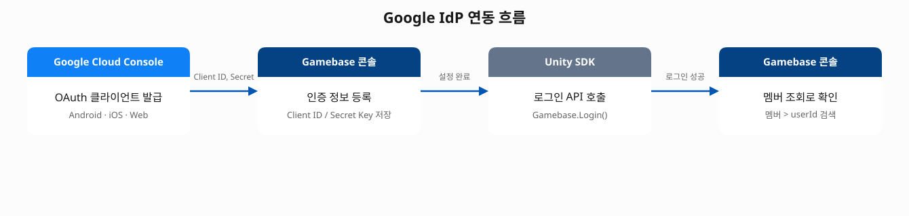
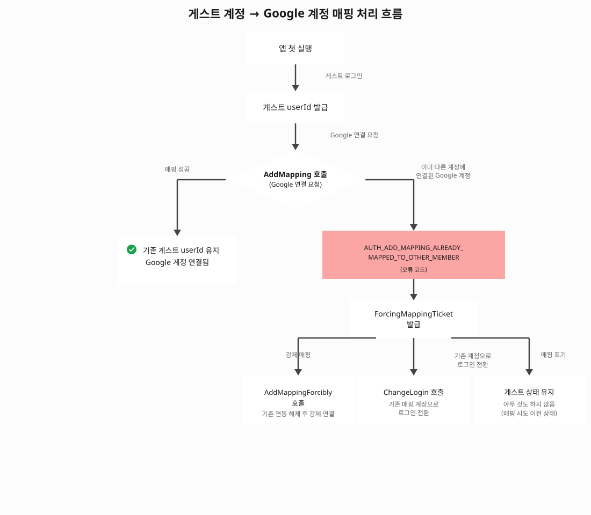

# Gamebase에 Google IdP를 연동해 소셜 로그인 구현하기

## 시작하기 전에

Gamebase로 게임 백엔드를 구축할 때 소셜 계정 로그인을 붙이려면 외부 인증 공급자인 IdP(identity provider, 아이디 제공자)와의 연동이 필요합니다. Google IdP 연동은 Google Cloud Console, Gamebase 콘솔, 클라이언트 SDK 이렇게 세 곳에 설정이 흩어져 있어 어떤 순서로 무엇을 해야 할지 헷갈리기 쉽습니다. 이 가이드는 그 흐름을 한 줄로 이어서 보여줍니다.

이 가이드를 따라 하면 Google Cloud Console에서 OAuth 클라이언트를 발급하고, Gamebase 콘솔과 Unity SDK에 연결해 게임 사용자가 Google 계정으로 로그인할 수 있는 환경을 처음부터 끝까지 구현할 수 있습니다.

연동은 다음 네 단계로 이루어집니다.



## 시나리오 환경 구성

이 가이드를 따라 하려면 아래 두 계정이 모두 필요합니다. NHN Cloud 계정만으로는 따라 할 수 없으며, Google 계정은 NHN Cloud와 별개로 준비해야 합니다.

- **Google 계정**(개인 Gmail 또는 Google Workspace 조직 계정): Google Cloud Console에서 OAuth 클라이언트를 발급하는 데 사용합니다.
- **NHN Cloud 계정**: Gamebase 콘솔 설정에 사용합니다.

그 외 아래 조건도 확인합니다.

- NHN Cloud 프로젝트에서 Gamebase 서비스가 활성화되어 있어야 합니다. Gamebase 서비스를 활성화하면 앱이 자동으로 생성되므로, 별도로 앱을 만드는 절차는 없습니다(프로젝트당 1개 앱으로 고정).
- Google Cloud 프로젝트에서 OAuth 동의 화면(브랜딩)이 구성되어 있어야 합니다. 아직 구성하지 않았다면 아래 [동의 화면(브랜딩) 구성하기](#동의-화면브랜딩-구성하기) 절을 먼저 따라 합니다.
- 게임 클라이언트 프로젝트(이 가이드에서는 Unity 기준)에 Gamebase SDK가 설치되어 있어야 합니다. 이 가이드는 Gamebase Unity SDK 2.81.4 이상 버전을 기준으로 작성되었습니다.
- Android 기기를 지원하는 경우, APK 서명에 사용하는 키스토어의 SHA-1 인증서 지문과 애플리케이션 패키지 이름을 미리 확인합니다.
- iOS 기기를 지원하는 경우, Xcode 프로젝트의 번들 ID를 미리 확인합니다.

> [!NOTE]
> 앱을 Google Play에 실제로 배포할 계획이라면 **Google Play 개발자 계정**(최초 1회 등록비 발생)도 필요합니다. 다만 로컬 APK로 개발 단계 테스트만 한다면, 이 계정 없이 디버그 키스토어만으로 이 가이드의 전 과정을 따라 할 수 있습니다.

## Google OAuth 클라이언트 발급하기

Gamebase는 Google 로그인을 처리할 때 Google이 발급한 클라이언트 자격 증명을 사용합니다. 내부적으로는 Android, iOS 모두 OpenID Connect(OIDC) 방식을 사용하며, ID Token을 전달받습니다. 가이드를 따라 클라이언트를 발급하고 콘솔에 등록하는 절차 자체는 이 내부 동작과 무관하게 동일합니다.

> [!NOTE]
> Android 단말의 Google Play services 버전이 낮은 경우에는 구버전 Google Sign-In API를 쓰는 레거시(legacy) 경로로 자동 전환되며, 이 경우에만 OAuth 2.0 인증 코드(authorization code) 방식이 사용됩니다.

먼저 Google Cloud Console에서 플랫폼별 클라이언트 ID와 Gamebase 서버가 사용할 웹 클라이언트 ID를 발급합니다.

### 동의 화면(브랜딩) 구성하기

OAuth 클라이언트 ID를 발급하려면 먼저 Google 인증 플랫폼에서 동의 화면 구성을 완료해야 합니다. 아직 구성한 적이 없다면 클라이언트 발급 전에 이 절의 단계를 먼저 완료합니다.

1. [Google Cloud Console](https://console.cloud.google.com/)에서 연동할 프로젝트를 선택한 뒤, 왼쪽 메뉴에서 **Google 인증 플랫폼 > 개요**로 이동합니다.

2. **동의 화면 구성**을 클릭하고 **시작하기**를 누르면 다음 4단계로 구성된 마법사가 나타납니다.

   - **앱 정보**: 앱 이름과 사용자 지원 이메일을 입력합니다.
   - **대상**: **내부**와 **외부** 중 하나를 선택합니다. 게임처럼 불특정 다수의 사용자를 대상으로 서비스한다면 **외부**를 선택합니다. **내부**는 Google Workspace 조직 내 사용자만 사용할 수 있는 경우에 한정됩니다.
   - **연락처 정보**: 담당자 이메일 등을 입력합니다.
   - **완료**: 약관에 동의하고 마무리합니다.

3. **만들기**를 클릭해 구성을 완료합니다.

> [!NOTE]
> **대상**을 **외부**로 설정하면 앱은 "테스트 중" 상태로 시작되며, **테스트 사용자** 목록에 **+ Add users**로 추가한 계정만 로그인할 수 있습니다. 앱 인증(정식 게시) 전까지 허용되는 사용자 한도는 100명이며, 앱의 전체 수명 주기 기준으로 계산됩니다. 앱을 정식 서비스로 전환하려면 별도의 인증 절차가 필요합니다.
>
> 참고로 **내부**는 Google Workspace 조직 계정이 아니면 선택할 수 없습니다(버튼이 비활성화됨). 개인 Gmail 계정으로 만든 프로젝트라면 **외부**만 선택 가능합니다.

구성이 완료되면 **Google 인증 플랫폼 > 개요** 화면에 "아직 이 프로젝트에 OAuth 클라이언트를 구성하지 않았습니다"라는 안내와 함께 **OAuth 클라이언트 만들기** 버튼이 나타납니다. 이 버튼을 클릭하거나 왼쪽 메뉴의 **클라이언트**에서 플랫폼별 클라이언트를 발급합니다.

### Android용 클라이언트 발급하기

1. [Google Cloud Console](https://console.cloud.google.com/)에서 연동할 프로젝트를 선택하고, 왼쪽 메뉴에서 **Google 인증 플랫폼 > 클라이언트**를 클릭한 뒤 **+ 클라이언트 만들기**를 클릭합니다. 앞 절의 **개요** 화면에 나타난 **OAuth 클라이언트 만들기** 버튼을 클릭해도 됩니다.

2. **애플리케이션 유형**에서 **Android**를 선택하고 다음 정보를 입력합니다.

   | 필드 | 설명 |
   | --- | --- |
   | **이름** | 식별할 수 있는 이름(예: `MyGame-Android`, 기본값 자동 입력됨) |
   | **패키지 이름** | APK의 패키지 이름(예: `com.example.mygame`, `AndroidManifest.xml` 파일에서 확인 가능) |
   | **SHA-1 인증서 디지털 지문** | 서명 키스토어의 SHA-1 지문 |

   SHA-1 지문은 다음 명령으로 확인할 수 있습니다.

   ```sh
   keytool -keystore {keystore_path} -list -v
   ```

   개발 단계에서 디버그 키스토어를 사용한다면 다음 명령으로 SHA-1 지문을 확인합니다. 디버그 키스토어는 기본적으로 macOS/Linux에서는 `~/.android/debug.keystore`, Windows에서는 `%USERPROFILE%\.android\debug.keystore`에 있습니다.

   ```text
   keytool -list -v -keystore {debug_keystore_path} -alias androiddebugkey -storepass android -keypass android
   ```

   `{debug_keystore_path}`는 위 경로 중 자신의 OS에 맞는 값으로 바꿔 입력합니다. (Windows 명령 프롬프트는 `~` 표기를 경로로 인식하지 않으므로, 반드시 `%USERPROFILE%\.android\debug.keystore`처럼 전체 경로를 입력합니다.)

   화면 하단의 **앱 소유권 확인(선택사항)** 항목은 필수가 아니므로 생략해도 됩니다.

3. **만들기**를 클릭합니다. Android 클라이언트는 클라이언트 보안 비밀번호(Client Secret) 없이 클라이언트 ID만 발급됩니다.

> [!NOTE]
> Google Play에 앱을 등록했다면 Play 앱 서명이 적용된 SHA-1도 추가로 등록해야 합니다. Google Play Console에서 해당 앱을 선택한 뒤 **Google Play로 보호됨 > Play 스토어 보호 > 앱 서명 키 보호 > Play 앱 서명 관리**로 이동하면 **앱 서명 키** 섹션에서 **SHA-1 인증서 지문**을 확인할 수 있습니다.

### iOS용 클라이언트 발급하기

1. 같은 **Google 인증 플랫폼 > 클라이언트** 화면에서 **+ 클라이언트 만들기**를 클릭합니다.

2. **애플리케이션 유형**에서 **iOS**를 선택하고 다음 정보를 입력합니다.

   | 필드 | 설명 |
   | --- | --- |
   | **이름** | 식별할 수 있는 이름(기본값 자동 입력됨) |
   | **번들 ID** | Xcode 프로젝트의 번들 ID(예: `com.example.mygame`, 앱의 `Info.plist` 파일에서 확인 가능) |
   | **App Store ID**, **팀 ID** | 앱이 App Store에 게시된 경우 입력(선택 사항) |

   화면 하단의 **Firebase 앱 체크** 옵션은 Firebase 프로젝트가 필요한 별도 기능이므로 선택 사항입니다.

3. **만들기**를 클릭합니다. iOS 클라이언트는 Android와 마찬가지로 클라이언트 보안 비밀번호 없이 클라이언트 ID만 발급됩니다.

    > [!NOTE]
    > 생성 완료 화면에 "OAuth 액세스는 OAuth 동의 화면에 나열된 테스트 사용자로 제한됩니다"라는 안내가 표시됩니다. 앱이 "테스트 중" 상태인 동안에는 [동의 화면(브랜딩) 구성하기](#동의-화면브랜딩-구성하기)에서 테스트 사용자로 등록한 계정으로만 로그인 테스트가 가능합니다.

발급한 iOS 클라이언트 ID는 나중에 Gamebase 콘솔의 **인증 정보** 화면에서 웹 클라이언트 ID와 함께 등록합니다. 자세한 입력 형식은 아래 [Gamebase 콘솔에 인증 정보 등록하기](#gamebase-콘솔에-인증-정보-등록하기) 절을 참고합니다.

> [!WARNING]
> iOS에서 Google 로그인을 사용하려면 URL Scheme을 반드시 설정해야 합니다. Xcode 프로젝트의 **TARGETS > Info > URL Types**에 등록합니다.
>
> - **Gamebase iOS SDK 2.35.0 이상**: Google Cloud Console에서 iOS 클라이언트 상세 화면을 열면 **Additional information > iOS URL 스키마** 항목에 직접 표시되는 값(형식: `com.googleusercontent.apps.{client_id_prefix}`)을 그대로 복사해서 등록합니다. `Info.plist`에 직접 작성한다면 `CFBundleURLTypes` 항목에 등록합니다.
> - **Gamebase iOS SDK 2.34.1 이하**: `tcgb.{bundle_id}.google` 형식을 사용하는 별도의 IdP Settings (Legacy) 절차를 따라야 합니다.
>
> 자세한 내용은 [Gamebase iOS SDK 사용 가이드: 시작하기](https://docs.nhncloud.com/ko/Game/Gamebase/ko/ios-started/)와 [IdP Settings (Legacy)](https://docs.nhncloud.com/ko/Game/Gamebase/ko/ios-started/#idp-settings-legacy)를 참고합니다.

### 웹(서버) 클라이언트 발급하기

Gamebase 서버가 Google의 토큰 유효성을 검사할 때 사용하는 웹 클라이언트 ID가 추가로 필요합니다. Gamebase 콘솔에 등록하는 값이 이 웹 클라이언트의 자격 증명입니다.

1. 같은 **Google 인증 플랫폼 > 클라이언트** 화면에서 **+ 클라이언트 만들기**를 클릭합니다.

2. **애플리케이션 유형**에서 **웹 애플리케이션**을 선택합니다.

3. **이름**을 입력합니다.

4. **승인된 리디렉션 URI**에 다음 두 값을 모두 추가합니다. Gamebase 서버가 Google 인증 결과를 전달받는 콜백 주소입니다.

   ```text
   https://alpha-id-gamebase.toast.com/oauth/callback
   https://id-gamebase.toast.com/oauth/callback
   ```

5. **만들기**를 클릭합니다. 생성된 **클라이언트 ID**와 **클라이언트 보안 비밀번호**를 메모합니다. 다음 단계에서 Gamebase 콘솔에 입력합니다.

> [!WARNING]
> Gamebase 콘솔의 **인증 정보** 화면에 등록하는 Client ID/Secret Key는 반드시 **웹 애플리케이션** 클라이언트에서 발급한 값이어야 합니다. Android 클라이언트 ID는 콘솔에 등록하지 않고 플랫폼 인증에만 사용됩니다.

## Gamebase 콘솔에 인증 정보 등록하기

발급한 클라이언트 ID(웹/iOS)와 웹 클라이언트의 클라이언트 보안 비밀번호를 Gamebase 콘솔에 등록합니다. Google에서 발급한 클라이언트 보안 비밀번호는 Gamebase 콘솔의 **Secret Key** 필드에 입력합니다. 이 단계가 완료되어야 Gamebase가 Google 로그인 요청을 처리할 수 있습니다.

1. [NHN Cloud 콘솔](https://console.nhncloud.com/)에 로그인한 뒤 **Game > Gamebase**를 클릭합니다.

2. 상단 메뉴에서 **앱**을 클릭합니다.

3. 아래로 스크롤해 **인증 정보** 탭에서 **수정**을 클릭합니다.

4. **+** 버튼을 클릭해 행을 추가하고 다음 정보를 입력합니다.

   | 필드 | 설명 |
   | --- | --- |
   | **Identity Provider** | 드롭다운에서 **Google**을 선택합니다. Facebook, Apple, Game Center, PAYCO, Twitter, NAVER, LINE, Weibo, Kakao games, Steam, GPGS v2, Epic Games 등도 같은 드롭다운에서 선택할 수 있습니다. |
   | **Client ID** | 입력란이 위아래 두 칸으로 나뉘어 있습니다. 위 칸에는 웹 클라이언트의 Client ID(`{web_client_id}`)를, 아래 칸(플레이스홀더: "iOS Client ID를 입력하세요")에는 iOS 클라이언트의 Client ID(`{ios_client_id}`)를 그대로 입력합니다. iOS를 지원하지 않으면 아래 칸은 비워둡니다. |
   | **Secret Key** | 웹 클라이언트의 클라이언트 보안 비밀번호를 입력합니다. |
   | **토큰 재검증** | 클라이언트에서 Latest Login API(마지막으로 로그인한 IdP로 다시 로그인하는 API, Unity SDK의 `Gamebase.LoginForLastLoggedInProvider()`) 호출 시 외부 IdP 토큰의 재검증 여부를 설정합니다. **검증 안 함**(기본값)을 선택하면 Gamebase 내부 토큰만 검증하고, **항상 검증**을 선택하면 외부 IdP 토큰까지 매번 유효성을 검증합니다. |
   | **추가 정보 & Callback URL** | **추가 정보**는 JSON 문자열로 OAuth 2.0 scope(접근 권한 범위)를 설정합니다. Google 로그인 후 프로필에서 이메일 정보를 받으려면 다음과 같이 입력합니다.<br>`{ "scope": ["email"] }`<br>이메일 외에 필요한 scope가 있으면 배열에 추가합니다(예: `{ "scope": ["email", "myscope1"] }`). 사용 가능한 scope 목록은 [Google OAuth 2.0 Scopes](https://developers.google.com/identity/protocols/oauth2/scopes) 문서를 참고합니다. **Callback URL**은 Google의 경우 입력란이 비활성화되어 있고, Gamebase 서버가 사용하는 고정된 콜백 주소(`https://id-gamebase.toast.com/oauth/callback`)를 참고용으로 보여줍니다. 이 값은 앞서 [웹(서버) 클라이언트 발급하기](#웹서버-클라이언트-발급하기) 절에서 웹 클라이언트의 **승인된 리디렉션 URI**에 이미 등록해둔 값과 같습니다. |

    > [!NOTE]
    > **추가 정보**에 등록한 값은 기본값입니다. Unity SDK의 `Gamebase.Login(providerName, Dictionary<string, object> additionalInfo, callback)` 오버로드로 코드에서 직접 추가 정보를 전달하면, 콘솔에 등록한 값 대신 코드에서 넘긴 값이 우선 사용됩니다.

5. **저장**을 클릭합니다. 화면에 안내된 대로, 인증 정보가 실제로 반영되는 데는 최대 10분이 걸릴 수 있습니다.

> [!NOTE]
> 인증 정보는 Gamebase 앱 단위로 관리됩니다. Google 외에 다른 IdP를 추가하려면 **+** 버튼으로 행을 추가해 반복 등록합니다. 각 필드의 상세 명세는 [Gamebase 콘솔 가이드: 앱 / 인증 정보](https://docs.nhncloud.com/ko/Game/Gamebase/ko/oper-app/#authentication-information)를 참고합니다.

## Unity SDK에서 Google 로그인 구현하기

Gamebase 콘솔 설정이 완료됐으면 클라이언트 SDK에서 로그인 API를 호출합니다.

### SDK 초기화하기

Gamebase SDK는 초기화가 완료된 후에만 로그인 API를 호출할 수 있습니다. 앱 시작 시 한 번 초기화합니다.

```csharp
var configuration = new GamebaseRequest.GamebaseConfiguration
{
    appID = "{app_id}",            // Gamebase 앱 ID (콘솔에서 확인)
    appVersion = "1.0.0",          // 클라이언트 버전
    displayLanguageCode = GamebaseDisplayLanguageCode.Korean
};

#if UNITY_ANDROID
    configuration.storeCode = GamebaseStoreCode.GOOGLE;
#elif UNITY_IOS
    configuration.storeCode = GamebaseStoreCode.APPSTORE;
#elif UNITY_WEBGL
    configuration.storeCode = GamebaseStoreCode.WEBGL;
#elif UNITY_EDITOR_OSX || UNITY_STANDALONE_OSX
    configuration.storeCode = GamebaseStoreCode.MACOS;
#else
    configuration.storeCode = GamebaseStoreCode.WINDOWS;
#endif

Gamebase.Initialize(configuration, (launchingInfo, error) =>
{
    if (Gamebase.IsSuccess(error))
    {
        Debug.Log("Gamebase 초기화 성공");
    }
    else
    {
        Debug.LogError($"초기화 실패: {error}");
    }
});
```

> [!NOTE]
> `storeCode`는 앱이 배포되는 스토어를 나타내는 필수 항목입니다. `storeCode`를 설정하지 않고 초기화를 호출하면 `INVALID_PARAMETER(3)` 오류가 반환됩니다.

### Google 로그인 호출하기

초기화 콜백에서 성공을 확인한 뒤 다음 코드로 Google 로그인을 호출합니다.

```csharp
Gamebase.Login(GamebaseAuthProvider.GOOGLE, (authToken, error) =>
{
    if (Gamebase.IsSuccess(error))
    {
        string userId = authToken.member.userId;
        Debug.Log($"Google 로그인 성공. userId: {userId}");
    }
    else
    {
        if (error.code == (int)GamebaseErrorCode.SOCKET_ERROR ||
            error.code == (int)GamebaseErrorCode.SOCKET_RESPONSE_TIMEOUT)
        {
            Debug.LogWarning("네트워크 오류입니다. 재시도가 필요합니다.");
        }
        else
        {
            Debug.LogError($"로그인 실패: {error}");
        }
    }
});
```

`Gamebase.Login()` 호출 시 Google 계정 선택 화면이 기기에서 자동으로 표시됩니다. 사용자가 계정을 선택하고 권한을 허용하면 콜백에서 `authToken`을 받습니다. 이 `authToken`에는 Gamebase `userId`, 액세스 토큰, IdP 정보가 포함됩니다. SDK 인증 흐름 전체와 오류 코드 목록은 [Gamebase Unity SDK: Authentication](https://docs.nhncloud.com/ko/Game/Gamebase/ko/unity-authentication/)을 참고합니다.

> [!NOTE]
> Standalone/WebGL 플랫폼에서 Google 로그인을 사용하는 경우에는 `GamebaseAuthProviderCredential.REDIRECT_URI`를 추가로 입력해야 합니다. 이 값은 Google Cloud Console에서 웹 클라이언트에 등록한 **승인된 리디렉션 URI**에 이미 추가되어 있는 값과 일치해야 합니다. 입력하지 않으면 기본값(Standalone: `http://localhost:8080/`, WebGL: `http://localhost/`)이 적용되므로, 기본값을 사용한다면 해당 값도 **승인된 리디렉션 URI**에 추가로 등록합니다. 모바일(Android/iOS)에서는 필요하지 않습니다. 입력 방법은 [Gamebase Unity SDK: Authentication](https://docs.nhncloud.com/ko/Game/Gamebase/ko/unity-authentication/) 문서를 참고합니다.
>
> 이 `REDIRECT_URI`는 [Gamebase 콘솔에 인증 정보 등록하기](#gamebase-콘솔에-인증-정보-등록하기) 절에서 설명한 **Callback URL**과는 목적이 다릅니다. Callback URL은 Gamebase 서버가 쓰는 고정 주소를 보여주는 읽기 전용 안내이고, `REDIRECT_URI`는 Standalone/WebGL 클라이언트 앱이 로그인 완료 후 자기 자신으로 돌아오기 위해 개발자가 직접 지정하는 값입니다. 다만 두 값 모두 웹 클라이언트의 승인된 리디렉션 URI에 등록되어 있어야 한다는 점은 같습니다.

## 동작 확인하기

로그인 코드를 구현했다면 실제 기기에서 실행해 연동이 정상적으로 완료됐는지 확인합니다.

1. 앱을 기기에 설치하고 Google 로그인을 호출합니다.

2. 계정 선택 화면에서 Google 계정을 선택하고 권한 허용을 완료합니다.

3. 로그인 콜백에서 `Gamebase.IsSuccess(error)`가 `true`이고 `userId`가 출력되는지 확인합니다.

4. [NHN Cloud 콘솔](https://console.nhncloud.com/)에 로그인한 뒤 **Game > Gamebase**로 이동합니다.

5. 상단 메뉴에서 **멤버**를 클릭합니다.

6. 로그인한 계정의 User ID(로그인 콜백에서 출력한 `userId`) 또는 IdP ID로 검색합니다.

7. 멤버 상세 화면의 **아이디 제공자** 항목에 Google 계정이 연결된 것을 확인합니다. 이 표에는 **IdP**, **IdP ID**, **등록일** 컬럼이 표시됩니다.

멤버 목록에 나타나고 아이디 제공자에 Google IdP가 표시되면 연동이 완료된 것입니다.

> [!NOTE]
> **멤버** 메뉴의 상세 설명은 [Gamebase 콘솔 가이드: 회원](https://docs.nhncloud.com/ko/Game/Gamebase/ko/oper-member/)을 참고합니다.

## 응용하기

### 게스트 계정을 Google 계정에 매핑하기

많은 게임이 처음 실행 시 회원가입 없이 게스트로 플레이하게 하고, 이후 Google 계정에 연결(매핑)해 데이터를 이어받게 합니다. Gamebase의 매핑 기능이 이 역할을 담당합니다. 매핑이 완료된 후에는 Google 계정으로 로그인해도 기존 게스트 `userId`와 게임 데이터가 그대로 유지됩니다.



매핑 API를 호출합니다.

```csharp
Gamebase.AddMapping(GamebaseAuthProvider.GOOGLE, (authToken, error) =>
{
    if (Gamebase.IsSuccess(error))
    {
        Debug.Log("Google 계정 매핑 성공");
    }
    else if (error.code == (int)GamebaseErrorCode.AUTH_ADD_MAPPING_ALREADY_MAPPED_TO_OTHER_MEMBER)
    {
        // 매핑하려는 Google 계정이 이미 다른 Gamebase 계정에 연결된 경우
        // ForcingMappingTicket.From()으로 강제 매핑에 필요한 티켓을 얻습니다.
        GamebaseResponse.Auth.ForcingMappingTicket forcingMappingTicket =
            GamebaseResponse.Auth.ForcingMappingTicket.From(error);

        Debug.LogWarning("이미 다른 계정에 연결된 Google 계정입니다.");
        // 아래 세 가지 처리 방법 참고
    }
    else
    {
        Debug.LogError($"매핑 실패: {error}");
    }
});
```

`AUTH_ADD_MAPPING_ALREADY_MAPPED_TO_OTHER_MEMBER` 오류로 얻은 `ForcingMappingTicket`은 다음 세 가지 방법 중 하나로 처리할 수 있습니다.

**1. 강제 매핑하기**: 기존에 연결되어 있던 계정의 연동을 끊고, 현재 게스트 계정에 강제로 매핑합니다.

```csharp
Gamebase.AddMappingForcibly(forcingMappingTicket, (authTokenForcibly, errorForcibly) =>
{
    if (Gamebase.IsSuccess(errorForcibly))
    {
        Debug.Log("강제 매핑 성공");
    }
    else
    {
        Debug.LogError($"강제 매핑 실패: {errorForcibly}");
    }
});
```

**2. 기존에 매핑된 계정으로 로그인 전환하기**: 현재 게스트 계정 대신, 이미 그 Google 계정과 연결되어 있던 계정으로 로그인합니다.

```csharp
Gamebase.ChangeLogin(forcingMappingTicket, (authTokenForcibly, errorForcibly) =>
{
    if (Gamebase.IsSuccess(errorForcibly))
    {
        Debug.Log("로그인 전환 성공");
    }
    else
    {
        Debug.LogError($"로그인 전환 실패: {errorForcibly}");
    }
});
```

**3. 매핑 포기하기**: 위 두 API를 호출하지 않고 그대로 두면, 매핑 시도 이전의 게스트 로그인 상태가 그대로 유지됩니다.

> [!NOTE]
> 강제 매핑, 로그인 전환, 매핑 포기 중 어떤 방식을 택할지는 서비스 정책에 따라 결정합니다. 예를 들어 "먼저 연결한 계정이 우선"이라면 사용자에게 안내 메시지를 띄우고 매핑을 포기하도록 유도하고, "최근 기기가 우선"이라면 강제 매핑을 실행하는 식입니다.

매핑 관련 전체 API와 오류 코드 목록은 [Gamebase Unity SDK: Authentication](https://docs.nhncloud.com/ko/Game/Gamebase/ko/unity-authentication/) 문서의 매핑 섹션을 참고합니다.

> [!NOTE]
> 매핑을 테스트한 경우, Gamebase 콘솔의 **멤버** 화면에서 해당 계정을 조회하면 상세 화면 하단의 **아이디 매핑 이력** 탭에서 매핑 처리 결과를 확인할 수 있습니다.

### 다중 IdP 구성하기

Gamebase는 하나의 계정에 여러 IdP를 동시에 연결할 수 있습니다. 예를 들어 Google과 Apple을 모두 연결하면 사용자가 어느 계정으로 로그인해도 같은 게임 데이터에 접근합니다. 추가 IdP를 연결하려면 `AddMapping()`의 IdP 이름만 바꿔 반복 호출합니다.

```csharp
// Apple IdP 추가 매핑 예시
Gamebase.AddMapping(GamebaseAuthProvider.APPLEID, (authToken, error) =>
{
    // ...
});
```

다중 IdP를 설정할 때는 Gamebase 콘솔의 **인증 정보** 화면에 각 IdP의 **Client ID**와 **Secret Key**를 모두 등록해야 합니다.

### 서버에서 액세스 토큰 검증하기

이 가이드는 Unity 클라이언트에서 Google 로그인을 붙이는 흐름을 다룹니다. 게임이 자체 백엔드 서버를 운영하고 있고, 그 서버에서 Gamebase가 발급한 액세스 토큰을 다시 한번 검증하려면 서버용 REST API를 별도로 사용할 수 있습니다. 이 API는 `Content-Type`, `X-TCGB-Transaction-Id`, `X-Secret-Key` 헤더를 사용하는 REST 호출 형태로 제공되며, 자세한 내용은 [Gamebase API 가이드: Authentication](https://docs.nhncloud.com/ko/Game/Gamebase/ko/api-guide/#authentication)을 참고합니다. 이 API는 이 가이드의 필수 단계가 아니며, 서버 개발자를 위한 참고 자료입니다.

