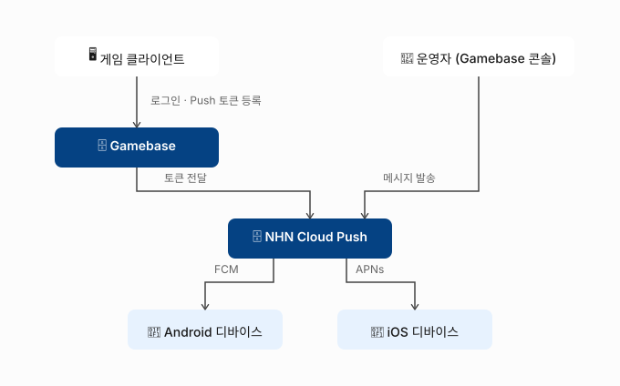

# Gamebase 연동 후 Push 메시지 발송까지 완료하기

이 가이드를 따라하면 Gamebase 로그인 사용자를 대상으로 Push 메시지를 발송할 수 있도록 연동하고, 테스트 발송으로 정상 동작 여부까지 확인할 수 있습니다.

Gamebase로 로그인 기능까지는 구현했지만 아직 Push 알림은 연동하지 않아, 이벤트 공지나 복귀 유도 메시지처럼 로그인한 사용자에게 직접 알림을 보내지 못하고 있는 게임 서버 개발자를 위한 가이드입니다.

## 시작하기 전에

- Gamebase 서비스가 활성화되어 있고, 클라이언트에 로그인 기능이 구현되어 있어야 합니다.
- Android 앱이라면 **FCM(Firebase Cloud Messaging, Android·iOS·웹용 크로스 플랫폼 메시지 발송 서비스)** 연동을 위해 Firebase 콘솔에서 다음 두 파일을 준비합니다. 두 파일은 용도가 달라서 헷갈리면 인증서 등록 오류가 날 수 있습니다.

    | 파일 | 받는 방법 | 용도 | 사용 위치 |
    |---|---|---|---|
    | `google-services.json` | Firebase 프로젝트에 Android 앱을 추가(패키지명 입력)한 뒤 다운로드 | 앱의 Firebase 설정 | 클라이언트 프로젝트(Unity, Android Studio 등) |
    | 서비스 계정 인증 정보(Service Account Credential)가 담긴 JSON 파일 | Firebase 콘솔 > 프로젝트 설정 > 서비스 계정에서 새 비공개 키 생성 | 서버가 FCM을 호출할 권한 | Gamebase 콘솔의 **푸시 > 인증서** |

    Firebase 프로젝트 생성, 앱 추가, `google-services.json` 배치는 [Android 프로젝트에 Firebase 추가](https://firebase.google.com/docs/android?hl=ko)를 참고하세요. Unity나 Unreal로 빌드한다면 처리 방법이 다르므로 [Android SDK 사용 가이드 > 시작하기](https://docs.nhncloud.com/ko/Game/Gamebase/ko/aos-started/)의 Firebase Notification 항목을 참고하세요. Firebase 설정에 문제가 있으면 `registerPush`가 5101 오류(상세 코드 101)를 반환할 수 있습니다.

    FCM은 2024년 6월 20일부로 기존 서버 키(Server Key) 방식 지원을 중단했으므로, 서버 키가 아닌 서비스 계정 JSON 파일을 준비해야 합니다.
- iOS 앱이라면 **APNs(Apple Push Notification service, Apple 기기로 알림을 보내는 Apple의 플랫폼 알림 서비스) 인증 정보**를 준비합니다. Gamebase는 JWT(JSON Web Token, 서명된 토큰으로 신원을 증명하는 인증 방식) 등록만 지원하므로, Apple Developer 계정에서 발급받은 Team ID, Key ID, Topic(일반적으로 앱의 Bundle ID), 개인 키(`.p8`) 파일을 준비해야 합니다.
- Android SDK를 사용한다면 `build.gradle`의 dependencies에 Push 어댑터 모듈을 추가합니다. 추가하지 않으면 `registerPush`가 5101 오류(상세 코드 103)를 반환할 수 있습니다.

    ```gradle
    implementation "com.toast.android.gamebase:gamebase-adapter-push-fcm:$GAMEBASE_SDK_VERSION"
    ```

## Push 연동하고 테스트 발송까지 확인하기

Gamebase는 내부적으로 NHN Cloud Push 서비스를 이용해 Android·iOS 앱으로 메시지를 발송합니다. 다만 Gamebase 콘솔에서만 설정하면 되며, Notification > Push 서비스를 별도로 활성화하거나 설정할 필요는 없습니다. Gamebase에 로그인한 사용자에게 메시지를 보내려면, 클라이언트가 발급받은 Push 토큰을 Gamebase SDK로 등록해 두어야 합니다. 이후 Gamebase 콘솔에서 메시지를 발송하면 등록된 토큰을 기준으로 FCM 또는 APNs를 통해 각 디바이스에 전달됩니다.



1. Gamebase 콘솔에서 대상 앱의 **푸시 > 인증서** 화면으로 이동하세요.

    인증 정보 등록부터 메시지 발송까지 모두 이 Gamebase 콘솔 안에서 처리합니다.

2. Android 앱이라면 **FCM Service Account Credential** 항목의 **등록**을 클릭하고, 준비한 FCM 서비스 계정 JSON 파일 내용을 **JSON** 입력란에 붙여넣은 뒤 **저장**을 클릭하세요.

    Push는 이 인증 정보로 FCM API를 대신 호출해 Android 디바이스에 메시지를 전달합니다. 인증 정보가 없으면 Android 발송 채널 자체가 동작하지 않습니다.

    서비스 계정 JSON 파일에는 비공개 키가 들어 있으니, 메신저나 이메일, 외부 서비스로 공유하거나 소스 저장소에 커밋하지 말고 콘솔에 직접 등록하세요.

3. iOS 앱이라면 **APNS JWT** 항목의 **등록**을 클릭하고, 준비한 Team ID, Key ID, Topic, Private Key를 입력한 뒤 **저장**을 클릭하세요.

    Gamebase는 APNs 인증 방식으로 JWT만 지원합니다. `.p12` 인증서 등록은 제공되지 않으므로, Apple Developer 계정에서 반드시 `.p8` 키 기반의 JWT 인증 정보를 발급받아 준비해야 합니다.

    `.p8` 개인 키 파일도 메신저나 이메일, 외부 서비스로 공유하거나 소스 저장소에 커밋하지 말고 콘솔에 직접 등록하세요.

4. 클라이언트 로그인이 끝난 뒤, SDK에서 Push 토큰을 등록하는 코드를 추가하세요.

    ```java
    PushConfiguration configuration = PushConfiguration.newBuilder()
            .enablePush(enablePush)
            .enableAdAgreement(enableAdPush)
            .enableAdAgreementNight(enableAdNightPush)
            .build();

    Gamebase.Push.registerPush(activity, configuration, new GamebaseCallback() {
        @Override
        public void onCallback(GamebaseException exception) {
            if (Gamebase.isSuccess(exception)) {
                // 토큰 등록 성공
            }
        }
    });
    ```

    `enableAdAgreement`, `enableAdAgreementNight`는 각각 광고성 정보 수신 동의, 야간 광고성 정보 수신 동의 여부를 나타냅니다. 사용자가 앱 내 약관 동의 화면에서 선택한 값을 그대로 전달하면, 이후 발송 시 Gamebase가 이 값을 기준으로 미동의 대상자를 발송 대상에서 제외합니다.

    > [주의]
    > 동의값은 UserID 단위가 아니라 Push 토큰 단위로 Push 서버에 저장됩니다. 푸시 토큰이 만료되는 경우도 있으므로, 로그인 이후에는 앱을 실행하거나 계정을 전환할 때마다 `registerPush` API를 호출해 최신 값을 서버에 반영하세요.

    로그인 전에 토큰을 등록하면 어떤 사용자의 디바이스인지 식별할 수 없으므로, 반드시 로그인 성공 콜백 이후에 호출합니다. Android에서는 로그인 전에 호출하면 5101 오류(상세 코드 102)가 발생하며, 상세 코드는 `exception.getDetailCode()`로 확인할 수 있습니다. iOS는 `TCGBPush registerPushWithPushConfiguration:completion:`으로 동일하게 구현합니다. 플랫폼별 전체 파라미터와 오류 코드는 [Android Push 가이드](https://docs.nhncloud.com/ko/Game/Gamebase/ko/aos-push/), [iOS Push 가이드](https://docs.nhncloud.com/ko/Game/Gamebase/ko/ios-push/)를 참고하세요.

5. Gamebase 콘솔의 Push 메시지 발송 화면에서 테스트 메시지를 즉시 발송해 연동을 확인하세요.

    소수 디바이스로 먼저 테스트하면 인증 정보나 토큰 등록 오류를 전체 사용자 발송 전에 미리 발견할 수 있습니다.

    > [주의]
    > 발송하기 전에 테스트 디바이스에서 앱을 백그라운드로 내려 두세요. 앱이 포그라운드(화면에 떠 있어 사용 중인 상태)일 때는 알림이 표시되지 않습니다. 포그라운드 알림 노출 옵션(Android `enableForeground`, Unity·iOS `foregroundEnabled`)의 기본값이 `false`(iOS는 `NO`)이기 때문입니다.

6. 로그인해 둔 테스트 디바이스에서 메시지가 정상적으로 수신되는지 확인하세요.

    Android 8.0(API 26) 이상 디바이스에서도 별도 채널 설정 없이 정상적으로 알림을 받을 수 있습니다. Gamebase가 서버 측에서 채널 값을 자동으로 지정해주기 때문입니다. 수신되지 않는다면 앱이 포그라운드 상태는 아닌지, 2~4단계에서 등록한 인증 정보나 토큰 등록 코드가 올바른지 다시 확인합니다.

## 응용하기

- **예약 발송**: 이벤트 시작 시각에 맞춰 미리 메시지를 준비해 두고 싶다면, 즉시 발송 대신 예약 발송 옵션을 사용합니다. Gamebase 콘솔의 Push 발송 화면은 즉시·예약·반복 발송을 모두 지원합니다.
- **야간 발송 제한 준수**: 정보통신망법에 따라 광고성 메시지는 야간(21시~08시)에 수신자의 별도 동의 없이 발송할 수 없습니다. 4단계에서 다룬 `enableAdAgreementNight`(iOS는 `ADAgreementNight`) 값에 사용자의 실제 동의 여부를 정확히 반영해 두면, 별도 처리 없이 야간 발송 대상에서 미동의 사용자가 자동으로 제외됩니다.

## 용어 정리

| 용어 | 설명 |
|---|---|
| FCM | Android, iOS 및 웹 애플리케이션용 메시지 및 알림을 위한 크로스 플랫폼 클라우드 솔루션 |
| APNs | 타사 앱 개발자가 Apple 장치에 설치된 앱으로 알림 데이터를 보낼 수 있도록 Apple에서 만든 플랫폼 알림 서비스 |
| 토큰 | API와 상호 작용을 위해 사용자를 인증하고 권한을 부여하는 데 사용되는 식별 정보 |
| 인증서 | 인증 기관의 고유 키 또는 비밀 키를 사용하여 변조를 불가능하게 한 개체의 데이터 |
