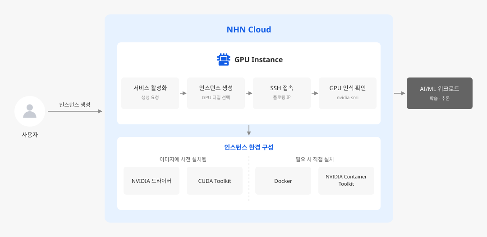

# GPU 인스턴스를 만들고 AI/ML 실행 환경 준비하기

## 시작하기 전에

GPU Instance는 가상 서버에 NVIDIA GPU를 추가로 구성해 제공하는 Compute 서비스입니다. 딥 러닝 학습과 추론, 고성능 컴퓨팅처럼 같은 연산을 대량으로 병렬 처리해야 하는 작업에서 CPU만 사용할 때보다 빠르게 결과를 얻을 수 있습니다. GPU Instance에서 선택할 수 있는 이미지에는 NVIDIA 드라이버와 CUDA(Compute Unified Device Architecture, NVIDIA GPU에서 범용 연산을 수행하기 위한 병렬 컴퓨팅 플랫폼)가 설치되어 제공되므로, 드라이버를 직접 내려받아 설치하는 과정 없이 인스턴스를 만든 직후부터 GPU를 사용할 수 있습니다.

여기에서는 GPU Instance 서비스를 활성화하고 T4 GPU 인스턴스를 생성한 뒤, 인스턴스에 접속해 GPU가 정상적으로 인식되는지 확인하고, 컨테이너에서 GPU를 사용할 수 있도록 NVIDIA Container Toolkit까지 구성하는 방법을 살펴봅니다.



서비스를 활성화하고 인스턴스를 생성한 뒤 SSH로 접속해 GPU 인식을 확인하는 흐름입니다. NVIDIA 드라이버와 CUDA Toolkit은 이미지에 사전 설치되어 제공되며, Docker와 NVIDIA Container Toolkit은 접속한 뒤 직접 설치합니다.


## 사전 준비하기

- GPU Instance 서비스를 활성화하려면 프로젝트 관리자 권한이 필요합니다. 권한이 없다면 프로젝트 관리자에게 활성화를 요청하세요.
- 인스턴스를 배치할 VPC와 서브넷이 하나 이상 있어야 합니다. 준비되어 있지 않다면 [VPC 콘솔 사용 가이드](https://docs.nhncloud.com/ko/Network/VPC/ko/console-guide/)를 참고해 **Network > VPC**에서 먼저 생성하세요.
- 인스턴스에 SSH로 접속할 키페어를 준비합니다. 키페어는 생성하는 시점에만 개인 키 파일을 내려받을 수 있으므로, 새로 만들었다면 파일을 안전한 위치에 보관하세요. 키페어는 **Compute > Key Pair**에서 관리하며, 인스턴스 생성 화면에서 바로 만들 수도 있습니다.
- SSH 접속을 허용하는 보안 그룹이 필요합니다. 규칙을 추가하는 방법은 아래 **SSH 접속 허용 규칙 추가하기**를 참고하세요.
- 외부에서 접속하려면 플로팅 IP가 필요합니다. 인스턴스를 생성하는 과정에서 함께 연결할 수 있으므로 미리 만들어 두지 않아도 됩니다.

> [!NOTE]
> GPU 인스턴스는 생성한 뒤에 인스턴스 타입을 변경할 수 없습니다. 작업에 필요한 GPU 개수와 GPU 메모리를 미리 가늠한 뒤 타입을 선택하세요.


### SSH 접속 허용 규칙 추가하기

**Network > Security Groups > 관리**에서 보안 그룹을 선택하고, **보안 규칙** 탭의 **보안 규칙 생성**에서 다음 규칙을 추가합니다.

- **방향**: `수신`을 선택합니다. 외부에서 인스턴스로 들어오는 트래픽을 의미합니다.
- **IP 프로토콜**: `TCP`를 선택합니다.
- **포트 범위**: `22`를 입력합니다. SSH가 사용하는 포트입니다.
- **Ether**: `IPv4`를 선택합니다.
- **원격**: `내 IP`를 선택합니다. 현재 접속 중인 공인 IP가 `{공인 IP}/32` 형식으로 자동 입력됩니다.
- **설명**: `SSH 접속 허용`처럼 규칙의 용도를 알아볼 수 있는 내용을 입력합니다.

규칙을 저장하면 **보안 규칙** 목록에 방향 `수신`, IP 프로토콜 `TCP`, 포트 범위 `22 (SSH)`로 표시됩니다.

프로젝트에 기본으로 있는 `default` 보안 그룹은 이 용도로 쓸 수 없습니다. `default`의 수신 규칙은 원격이 `default` 보안 그룹 자신으로 지정되어 있어, 같은 보안 그룹에 속한 인스턴스끼리의 통신만 허용하기 때문입니다.

> [!WARNING]
> **원격**에 `0.0.0.0/0`을 지정하면 모든 IP에서 SSH 접속이 가능해집니다. 실습 목적이라도 `내 IP`나 사무실·VPN 공인 IP 대역으로 좁히세요.


## GPU 인스턴스 생성하기


### 서비스 활성화하기

GPU Instance는 일반 Instance와 별개의 서비스입니다. 프로젝트에서 먼저 활성화해야 GPU 전용 이미지와 인스턴스 타입이 콘솔에 나타납니다.

1. NHN Cloud 콘솔에서 인스턴스를 만들 프로젝트를 선택하세요.
2. **Compute > GPU Instance**를 클릭하세요.
3. 서비스 활성화 창에서 **확인**을 클릭하세요.


### 인스턴스 생성하기

이 가이드에서는 `g2.t4.c4m32` 타입과 `Ubuntu Server 24.04.4 LTS with NVIDIA` 이미지를 기준으로 진행합니다. GPU 1개로도 드라이버 동작과 컨테이너 설정을 모두 확인할 수 있습니다. 선택할 수 있는 인스턴스 타입과 이미지 목록은 리전에 따라 다를 수 있으므로, 실제 목록은 인스턴스 생성 화면에서 확인하세요.

1. **GPU Instance 생성** 카드에서 **생성**을 클릭하세요. 인스턴스 생성 화면이 열립니다.
2. **OS 설정**의 **이미지**에서 `Ubuntu Server 24.04.4 LTS with NVIDIA`를 선택합니다. GPU Instance에서는 NVIDIA 드라이버와 CUDA가 설치된 공용 이미지만 제공됩니다.
  > [!WARNING]
  > 이미지에 설치된 것과 다른 드라이버 버전이 필요하다면, 설치된 버전을 삭제한 뒤 직접 해당 버전을 설치해야 합니다. NVIDIA와 CUDA 드라이버의 설치와 사용은 기술 지원 대상이 아닙니다.
3. **루트 블록 스토리지**를 설정합니다.
  - **블록 스토리지 타입**: `HDD`, `SSD`, `Encrypted HDD`, `Encrypted SSD` 중에서 선택합니다. 학습 데이터를 자주 읽는다면 `SSD`가 유리합니다.
    - **블록 스토리지 크기(GB)**: 선택한 이미지의 최소 크기(`Ubuntu Server 24.04.4 LTS with NVIDIA`는 `40`GB)부터 최대 `2048`GB까지 지정할 수 있습니다. 컨테이너 이미지와 체크포인트 파일이 빠르게 쌓이므로 최솟값보다 넉넉하게 잡으세요.
    - **삭제 정책**: 기본값은 **인스턴스 삭제 시 유지**입니다. 인스턴스를 지워도 루트 블록 스토리지가 남아 과금이 이어지므로, 실습용이라면 **인스턴스 삭제 시 삭제**를 선택하는 편이 안전합니다.
4. **기본 정보 설정**의 **인스턴스 정보**를 입력합니다.
  - **가용성 영역**: `임의의 가용성 영역`을 선택합니다.
    - **인스턴스 이름**: `gpu-t4-lab`처럼 용도를 알아볼 수 있는 이름을 입력합니다. 90자 이내의 영문자와 숫자, `-`, `.`만 사용할 수 있습니다.
    - **인스턴스 타입**: **인스턴스 타입 선택**을 클릭해 `g2.t4.c4m32`를 선택합니다.
    - **인스턴스 수**: `1`로 둡니다.
5. **키페어**에서 사전 준비하기에서 만든 키페어를 선택합니다. 인스턴스를 만든 뒤에는 키페어를 바꿀 수 없으므로 개인 키 파일을 가지고 있는 키페어인지 확인하세요. 목록에 없다면 **+ 생성**으로 이 화면에서 바로 만들 수 있습니다.
6. **네트워크 설정**에서 접속 경로를 구성합니다.
  - **네트워크**: 사용 가능한 서브넷 목록에서 인스턴스를 배치할 서브넷을 선택합니다.
    - **플로팅 IP**: **설정 변경**을 클릭해 **사용**을 체크합니다. 플로팅 IP가 없으면 NHN Cloud 외부에서 SSH로 접속할 수 없습니다.
    - **보안 그룹**: 사전 준비하기에서 SSH 수신 규칙을 추가한 보안 그룹을 선택합니다. 선택하면 아래 **선택된 보안 규칙** 표에 규칙이 표시되므로, 방향이 `수신`이고 포트 범위가 `22 (SSH)`, 원격이 접속할 공인 IP 대역인 규칙이 들어 있는지 확인하세요. 
7. 입력한 내용을 확인한 뒤 화면 아래의 **인스턴스 생성**을 클릭하세요. 인스턴스를 생성하는 순간부터 과금이 시작됩니다.
8. **GPU Instance 관리** 카드의 **관리**를 클릭해 인스턴스 목록을 엽니다. 목록에서 **상태**가 활성 상태로 바뀌면 접속할 수 있습니다.


## GPU 인식 확인하기

인스턴스가 활성화됐다고 해서 GPU를 바로 사용할 수 있는 것은 아닙니다. 드라이버가 올라와 있는지, 애플리케이션이 쓸 CUDA 버전이 무엇인지 접속해서 확인합니다.

1. **GPU Instance 관리** 카드의 **관리**를 클릭해 인스턴스 목록을 열고, `gpu-t4-lab` 행에서 **플로팅 IP** 값을 확인합니다. 이 값이 접속 주소입니다. 열이 비어 있다면 플로팅 IP가 연결되지 않은 상태이므로 **Network > Floating IP**에서 할당해 인스턴스에 연결하세요.
2. 개인 키 파일로 인스턴스에 접속합니다. Ubuntu 이미지의 계정 이름은 `ubuntu`입니다.
  ```sh
    ssh -i {key_file}.pem ubuntu@{floating_ip}
  ```
    처음 접속할 때는 호스트 키를 신뢰할지 묻는 메시지가 나타납니다. `yes`를 입력하면 프롬프트가 `ubuntu@{instance_name}:~$`로 바뀝니다.
    접속에 실패한다면 오류 메시지에 따라 원인을 좁힙니다.

  | 오류 메시지                          | 원인과 조치                                                                                                                                                                                       |
  | ------------------------------- | -------------------------------------------------------------------------------------------------------------------------------------------------------------------------------------------- |
  | `Connection timed out`          | 보안 그룹에 SSH 수신 규칙이 없거나, 규칙의 **원격** 값이 현재 공인 IP와 다릅니다. 사전 준비하기의 보안 그룹 규칙을 다시 확인하세요. 인스턴스에 실제로 적용된 보안 그룹을 고치고 있는지도 함께 대조합니다.                                                                    |
  | `Permission denied (publickey)` | 인스턴스에 지정한 키페어와 다른 개인 키를 사용했거나, 계정 이름을 `ubuntu`가 아닌 값으로 입력했습니다.                                                                                                                               |
  | `UNPROTECTED PRIVATE KEY FILE`  | 개인 키 파일을 본인 외의 사용자도 읽을 수 있는 위치에 두었습니다. 키 파일 권한을 좁힌 뒤 다시 시도하세요. Linux나 macOS에서는 `chmod 400 {key_file}.pem`, Windows에서는 `icacls {key_file}.pem /inheritance:r /grant:r "%USERNAME%:R"`을 실행합니다. |
  | 오류 없이 응답만 없음                    | 인스턴스가 아직 부팅 중일 수 있습니다. 생성 직후라면 1~2분 기다린 뒤 다시 시도하세요.                                                                                                                                          |

3. `nvidia-smi`로 드라이버가 GPU를 인식하는지 확인합니다. 이 명령은 드라이버가 정상 동작할 때만 결과를 출력하므로, GPU 상태를 확인하는 가장 빠른 방법입니다.
  ```sh
    nvidia-smi
  ```
    출력에서 다음 세 가지를 확인합니다.
  - 표 상단의 **Driver Version**: 설치된 NVIDIA 드라이버 버전입니다.
  - 표 상단의 **CUDA Version**: 이 드라이버가 지원하는 **최대** CUDA 버전입니다. 실제로 설치된 CUDA Toolkit 버전과는 다를 수 있습니다.
  - 표 하단의 GPU 목록: 선택한 타입의 GPU 개수와 모델명이 나옵니다.
4. 실제로 설치된 CUDA Toolkit 버전을 확인합니다. 프레임워크나 컨테이너 이미지를 고를 때 기준이 되는 값입니다.
  ```sh
    /usr/local/cuda/bin/nvcc --version
  ```

> [!WARNING]
> NVIDIA 드라이버와 CUDA 버전은 별도 공지 없이 업데이트됩니다. 특정 버전에 의존하는 코드를 운영한다면 버전을 문서에 적어 두는 대신, 배포 전에 위 두 명령으로 실제 값을 확인하는 절차를 넣으세요.


## 컨테이너에서 GPU 사용하기

학습 환경을 컨테이너로 관리하면 프레임워크와 CUDA 조합을 인스턴스마다 재설정 하지 않아도 됩니다. 다만 Docker는 기본적으로 호스트의 GPU 장치를 컨테이너에 넘겨주지 않으므로, NVIDIA Container Toolkit을 설치해 Docker 런타임에 GPU 연결 기능을 추가해야 합니다.

1. Docker를 설치합니다. 설치 방법은 [Docker 공식 문서](https://docs.docker.com/engine/install/ubuntu/)를 참고하세요. 이미 설치되어 있다면 이 단계를 건너뜁니다.
2. NVIDIA Container Toolkit 저장소를 등록하고 설치합니다.
  ```sh
    curl -fsSL https://nvidia.github.io/libnvidia-container/gpgkey \
      | sudo gpg --dearmor -o /usr/share/keyrings/nvidia-container-toolkit-keyring.gpg
    curl -s -L https://nvidia.github.io/libnvidia-container/stable/deb/nvidia-container-toolkit.list \
      | sed 's#deb https://#deb [signed-by=/usr/share/keyrings/nvidia-container-toolkit-keyring.gpg] https://#g' \
      | sudo tee /etc/apt/sources.list.d/nvidia-container-toolkit.list
    sudo apt-get update
    sudo apt-get install -y nvidia-container-toolkit
  ```
3. Docker가 NVIDIA 런타임을 사용하도록 설정합니다. 설정 파일을 직접 편집하는 대신 `nvidia-ctk`를 쓰면 런타임 등록을 자동으로 처리합니다.
  ```sh
    sudo nvidia-ctk runtime configure --runtime=docker
  ```
4. 컨테이너 안에서 GPU가 보이는지 확인합니다. `--gpus all` 옵션이 호스트의 GPU를 컨테이너에 연결합니다.
  ```sh
    sudo docker run --rm --gpus all nvidia/cuda:{cuda_version}-base-ubuntu22.04 nvidia-smi
  ```
    호스트에서 실행했을 때와 같은 GPU 목록이 나오면 성공입니다. 런타임 등록이 되지 않았다면 컨테이너가 시작되지 않고 `could not select device driver "" with capabilities: [[gpu]]` 오류가 발생하므로, 이 오류가 보이면 3단계를 다시 확인하세요.
  > [!NOTE]
  >
  > - 이때 출력되는 **CUDA Version**은 컨테이너 이미지의 CUDA 버전이 아니라 **호스트 드라이버가 보고하는 값**입니다. `nvidia-smi`는 컨테이너 안에서 실행해도 호스트 드라이버의 정보를 그대로 표시하므로, 이미지보다 높은 버전이 표시되더라도 정상입니다.
  >
  > - `{cuda_version}`에는 `nvidia-smi`가 표시한 **CUDA Version** 이하의 버전을 지정하세요. 호스트 드라이버가 지원하는 것보다 높은 CUDA 버전의 컨테이너 이미지를 실행하면 컨테이너가 GPU를 인식하지 못합니다. 사용 가능한 태그는 [Docker Hub의 nvidia/cuda](https://hub.docker.com/r/nvidia/cuda/tags)에서 확인합니다.


## 응용하기

- **프레임워크까지 설치된 이미지로 시작하기**: 이미지 선택 단계에서 `for Deep Learning` 이미지를 고르면 TensorFlow, PyTorch, cuDNN, JupyterLab이 설치된 상태로 시작합니다. 프레임워크와 CUDA 버전 조합을 직접 맞출 필요가 없습니다. 포함된 구성 요소와 버전은 [Deep Learning Instance 개요](https://docs.nhncloud.com/ko/Machine%20Learning/Deep%20Learning%20Instance/ko/overview/)를 참고하세요.
- **학습 작업을 관리형으로 운영하기**: 인스턴스를 직접 띄우고 내리는 대신 학습 작업, 모델, 엔드포인트를 서비스로 관리하려면 AI EasyMaker를 사용합니다. [AI EasyMaker 개요](https://docs.nhncloud.com/ko/Machine%20Learning/AI%20EasyMaker/ko/overview/)
- **설정을 끝낸 환경을 여러 대로 복제하기**: Docker와 라이브러리 설치까지 마친 인스턴스를 이미지로 만들어 두면, 같은 환경의 GPU 인스턴스를 반복해서 만들 수 있습니다. [Image 개요](https://docs.nhncloud.com/ko/Compute/Image/ko/overview/)


## 리소스 정리하기

실습 목적으로 따라한 경우, 더 이상 사용하지 않는 리소스를 삭제해 불필요한 과금을 방지합니다. 생성할 때와 반대 순서로, 인스턴스를 먼저 지우고 남은 스토리지와 IP를 정리합니다.

1. **Compute > GPU Instance**에서 **GPU Instance 관리** 카드의 **관리**를 클릭해 인스턴스 목록을 엽니다.
2. 목록에서 `gpu-t4-lab` 인스턴스를 선택하고 삭제합니다.
3. 생성할 때 **삭제 정책**을 기본값인 **인스턴스 삭제 시 유지**로 두었다면 루트 블록 스토리지가 남습니다. **Storage > Block Storage > 관리**에서 해당 볼륨을 함께 삭제합니다. 학습 데이터를 추가 블록 스토리지에 두었다면 그 볼륨도 같은 화면에서 정리합니다.
4. 플로팅 IP를 더 쓰지 않는다면 **Network > Floating IP**에서 반납합니다. 인스턴스를 삭제해도 플로팅 IP는 그대로 남아 과금됩니다.

> [!WARNING]
> 블록 스토리지를 삭제하면 저장된 데이터는 복구할 수 없습니다. 작업 결과물은 삭제 전에 Object Storage 등 다른 저장소로 옮기세요.


## 용어 알아보기


| 용어           | 설명                                                           |
| ------------ | ------------------------------------------------------------ |
| GPU instance | 인스턴스에 GPU(graphics processing unit)이 추가로 구성된 가상 서버           |
| 이미지          | 애플리케이션을 실행하기 위해 필요한 모든 소프트웨어 및 설정이 패키징된 가상 디스크               |
| 인스턴스         | 가상의 CPU, 메모리, 기본 디스크로 구성된 가상 서버                              |
| vCPU         | 가상 중앙 처리 장치. 물리적 CPU의 코어를 논리적으로 분할하여 가상 머신에 할당함              |
| VPC          | 가상 사설 클라우드. 논리적으로 분리된 가상의 네트워크                               |
| 서브넷          | IP 네트워크를 더 작은 단위로 세분화한 IP 주소 영역                              |
| 키페어          | 공개 키 기반 구조(PKI)를 바탕으로 한 SSH 공개 키, 개인 키 쌍으로, 인스턴스 접속 수단으로 사용됨 |
| 보안 그룹        | 인스턴스의 송수신 트래픽을 제어하는 기능                                       |
| 블록 스토리지      | 데이터를 블록 단위로 나눠서 저장하는 블록 수준 데이터 스토리지                          |
| 가용성 영역       | 독립된 전원 및 네트워크를 갖춘 데이터 센터로, 인스턴스가 만들어지는 물리적인 위치               |
| 플로팅 IP       | 외부 네트워크와 통신할 수 있도록 별도 요청을 통해 지정된 네트워크로부터 할당 받는 IP 주소         |
| 컨테이너         | 애플리케이션이 다양한 컴퓨팅 환경에서 빠르고 안정적으로 실행되도록 코드와 모든 종속성을 패키지화한 것     |
