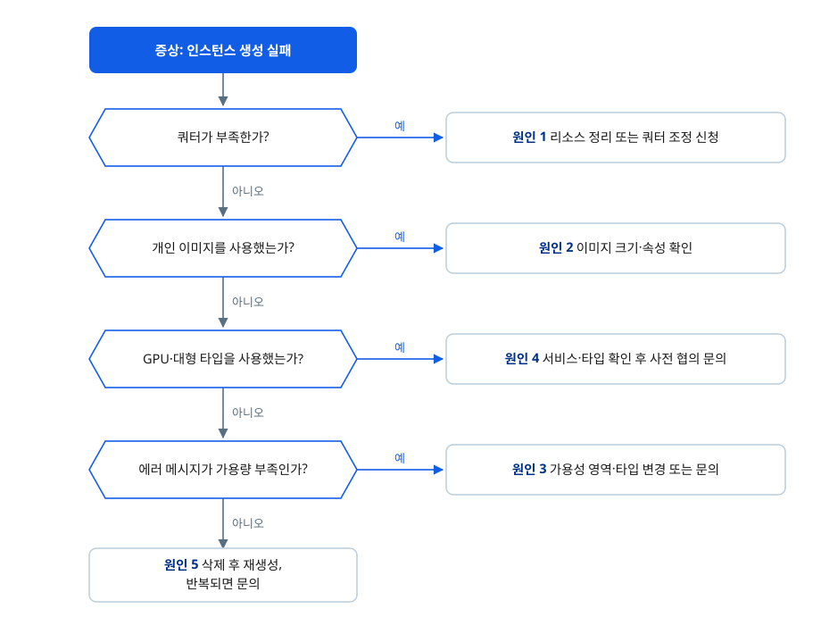

# 인스턴스 생성이 실패합니다

## 증상

NHN Cloud 콘솔 또는 API로 새 인스턴스를 생성했는데, 인스턴스가 정상 부팅되지 않고 오류 상태가 됩니다. 콘솔 인스턴스 목록의 **상태** 컬럼에 빨간색 색상으로 표시되며(정상은 초록색, 오류는 빨간색), 색상 표시에 마우스를 올리면 툴팁에 `ERROR`로 나타납니다.

주로 개인 이미지로 생성하거나, GPU 인스턴스·대형 인스턴스 타입(flavor)을 사용하거나, 특정 리전·가용성 영역(AZ)을 사용하는 경우에 나타날 수 있습니다.

## 빠른 확인

다음을 먼저 확인하세요. 이를 통해 원인을 좁힐 수 있습니다.

1. 인스턴스 목록의 **상태** 컬럼에서 오류(빨간색) 표시를 확인합니다. 색상 표시에 마우스를 올리면 툴팁에 `ERROR`가 나타나고, 목록 상단의 **인스턴스 상태** 필터에서 `ERROR`만 골라 볼 수도 있습니다. 이어서 해당 인스턴스를 선택해 하단 상세 화면의 **기본 정보** 탭에서 **로그 보기**와 생성 시 표시된 오류 메시지를 확인합니다. 어떤 단계에서 실패했는지 판단하는 근거가 됩니다.
2. 개인 이미지로 생성했다면, 공용 이미지로 같은 타입의 인스턴스를 생성해 봅니다. 공용 이미지로 정상 생성되면 이미지 문제로 좁혀집니다.
3. 프로젝트의 **쿼터 관리** 탭에서 인스턴스 쿼터가 남아 있는지 확인합니다. 쿼터가 부족하면 원인 1에 해당하고, 충분한데도 실패한다면 아래 다른 원인을 확인합니다.

## 원인과 해결 방법

인스턴스 생성이 실패하는 원인은 다양합니다. 다음 흐름으로 원인을 좁힌 뒤, 원인별로 이어지는 해결 방법을 적용하세요.



### 원인 1: 프로젝트 쿼터 초과

프로젝트에는 생성할 수 있는 인스턴스 수와 CPU·메모리 총량에 쿼터가 정해져 있습니다. 쿼터를 넘겨 요청하면 인스턴스 생성이 거부됩니다. 사용하지 않고 남아 있는 인스턴스와 블록 스토리지도 쿼터를 차지하므로, 실제로 운영 중인 리소스가 적어도 쿼터가 모자랄 수 있습니다. 특히 생성에 실패해 오류 상태로 남은 인스턴스도 쿼터를 계속 점유합니다.

쿼터를 초과하면 다음과 같은 메시지가 표시됩니다.

- 인스턴스 수 초과: "사용할 수 있는 인스턴스 가용량이 넘어 추가로 인스턴스를 생성할 수 없습니다. 한도를 높이려면 고객지원에 문의하세요."
- CPU 초과: "사용 가능한 CPU 용량을 초과했습니다. 불필요한 인스턴스를 삭제하고 다시 시도하세요. 한도를 높이려면 고객지원에 문의하세요."
- 메모리 초과: "사용 가능한 메모리 용량을 초과했습니다. 불필요한 인스턴스를 삭제하고 다시 시도하세요. 한도를 높이려면 고객지원에 문의하세요."

**해결 방법**

1. 프로젝트의 **쿼터 관리** 탭에서 인스턴스, CPU, 메모리 항목의 사용량과 한도를 확인합니다.
2. 사용하지 않는 인스턴스와 블록 스토리지를 삭제해 쿼터를 확보한 뒤 다시 생성합니다. 오류 상태로 남은 인스턴스도 함께 정리합니다.
3. 리소스를 정리할 수 없거나 더 많은 리소스가 필요하면 **쿼터 관리** 탭의 **쿼터 조정 신청** 버튼으로 한도 상향을 신청합니다.

### 원인 2: 개인 이미지의 크기·속성 조건 불일치

개인 이미지로 인스턴스를 생성할 때, 이미지가 요구하는 조건과 생성 설정이 맞지 않으면 생성에 실패합니다.

지정한 블록 스토리지가 이미지의 최소 디스크 크기보다 작으면 요청 단계에서 거부되고 "잘못된 입력 수신: 블록 스토리지 크기 {0}GB는 최소 디스크 이미지 크기 {1}GB보다 작을 수 없습니다." 메시지가 표시됩니다. 다른 클라우드에서 쓰던 OS 이미지를 그대로 가져오는 등 직접 변환한 이미지에서 주로 나타납니다.

이미지에 `os_type` 속성이 없어 실패하는 경우도 있습니다. `os_type`은 이미지가 어떤 운영체제인지 인스턴스 생성 단계에 알려 주는 값으로, 이 값이 없으면 인스턴스를 배치할 위치를 판단할 수 없어 실제 자원이 충분한데도 "선택한 인스턴스 타입의 가용량이 부족하여 인스턴스를 생성할 수 없습니다." 메시지가 표시됩니다. 현재 이미지 생성 API는 `os_type`을 필수로 요구하므로 이 속성이 빠진 이미지를 새로 만들 수는 없고, 필수 요구 이전에 만들어 둔 개인 이미지를 계속 사용하는 경우에 해당합니다.

**해결 방법**

1. 인스턴스 생성 화면 이미지 목록의 **최소 블록 스토리지(GB)** 컬럼에서 이미지가 요구하는 크기를 확인하고, 블록 스토리지 크기를 그 값 이상으로 지정해 다시 생성합니다.
2. 예전에 만든 개인 이미지라면 `os_type`을 지정해 이미지를 다시 만듭니다. `os_type`은 콘솔과 API 모두 사후에 수정할 수 없으므로 재생성이 필요합니다. 이미지 생성 API는 빈 이미지를 만드는 단계와 파일을 업로드하는 단계로 나뉘며, 첫 단계에서 `os_type`을 지정합니다. 값은 `linux` 또는 `windows`만 허용됩니다. 자세한 필드는 [이미지 생성 API 가이드](https://docs.nhncloud.com/ko/Compute/Image/ko/public-api/#_8)를 참고하세요.
   1. `POST /v2/images`로 빈 이미지를 생성하면서 `os_type`(`linux`/`windows`)을 지정합니다. `os_type`과 `name`은 필수 필드입니다. `min_disk`, `min_ram`, `disk_format`, `container_format`은 선택 필드이지만, 이미지 특성에 맞게 함께 지정하는 것을 권장합니다.
   2. `PUT /v2/images/{imageId}/file`로 실제 이미지 바이너리 데이터를 업로드합니다.
3. 위 두 가지를 확인해도 계속 실패하면, 공용 이미지로는 정상 생성되는지 확인한 결과와 함께 문의하기로 진행합니다.

API로 이미지를 만들 때 예시는 다음과 같습니다.

```sh
# 1) 빈 이미지 생성 - os_type을 반드시 지정
curl -X POST "https://{리전}-api-image-infrastructure.nhncloudservice.com/v2/images" \
  -H "X-Auth-Token: ${TOKEN}" \
  -H "Content-Type: application/json" \
  -d '{
    "name": "my-rocky-image",
    "os_type": "linux",
    "disk_format": "qcow2",
    "container_format": "bare",
    "min_disk": 20
  }'

# 2) 응답으로 받은 이미지 ID에 바이너리 데이터 업로드
curl -X PUT "https://{리전}-api-image-infrastructure.nhncloudservice.com/v2/images/{imageId}/file" \
  -H "X-Auth-Token: ${TOKEN}" \
  -H "Content-Type: application/octet-stream" \
  --data-binary @my-rocky-image.qcow2
```

### 원인 3: 선택한 가용성 영역에서 해당 인스턴스 타입을 생성할 수 없음

인스턴스는 생성할 때 선택한 가용성 영역(AZ)에 배치됩니다. 인스턴스 타입은 리전과 AZ에 따라 제공되는 구성이 다를 수 있어, 요청한 AZ에서 선택한 타입을 배치할 수 없으면 생성에 실패하고 "선택한 인스턴스 타입의 가용량이 부족하여 인스턴스를 생성할 수 없습니다." 메시지가 표시됩니다.

같은 타입이라도 다른 AZ에서는 정상적으로 생성될 수 있으므로, 가용성 영역이나 인스턴스 타입을 바꿔 다시 시도해 보세요. 특정 리전·AZ에 특정 타입을 반드시 생성해야 한다면 문의로 확인할 수 있습니다.

**해결 방법**

1. 인스턴스를 생성할 때 다른 가용성 영역(AZ)을 선택해 다시 생성합니다. 같은 타입이라도 AZ에 따라 생성 가능 여부가 다를 수 있습니다.
2. 같은 AZ에서 다른 인스턴스 타입을 선택해 생성해 봅니다. 특정 타입에서만 실패하는지 확인할 수 있습니다.
3. 특정 리전과 AZ에 특정 타입을 반드시 생성해야 하면, 문의하기로 생성 가능한 구성을 확인합니다.

### 원인 4: 사전 협의가 필요한 GPU·대형(X-Flavor) 타입

GPU 인스턴스와 표준 타입 목록에 없는 대형 타입(X-Flavor)은 사전에 자원 할당이 협의된 뒤에만 생성할 수 있습니다. GPU 인스턴스는 일반 **Instance**의 인스턴스 타입 목록에는 나타나지 않고 별도의 **GPU Instance** 서비스로 제공됩니다. 쿼터가 여유 있어도 해당 타입이 리전에 준비되어 있지 않으면 생성에 실패하며, 협의된 것과 다른 타입을 선택했을 때도 실패합니다. 공공(GOV)이나 일부 특수 리전에서 GPU·대형(X-Flavor) 타입을 요청할 때 주로 발생할 수 있습니다.

**해결 방법**

1. GPU 인스턴스는 일반 **Instance**가 아니라 **GPU Instance** 서비스에서 생성합니다. 대형 타입은 **인스턴스 타입 선택** 목록에서 필요한 사양이 제공되는지 먼저 확인합니다. 목록에 없는 타입이라면 사전 협의가 필요한 특수 타입입니다.
2. 사전에 협의한 타입이 있다면 그 타입 이름과 정확히 일치하는지 확인해 생성합니다.
3. GPU 인스턴스나 대형 타입이 필요하면 문의하기로 자원 가용성과 노출을 요청합니다. 이 타입들은 사전 자원 협의가 필요합니다.

### 원인 5: 인스턴스 생성 중 내부 처리 실패

인스턴스 생성은 부팅 디스크로 사용할 블록 스토리지를 만들어 연결하고, 네트워크 인터페이스를 연결하는 단계를 거칩니다. 이 단계에서 일시적인 처리 실패가 발생하면 인스턴스가 부팅 디스크나 네트워크를 연결하지 못해 오류 상태가 됩니다.

이 실패는 사용자 설정과 무관하게 발생하며 대부분 일시적입니다. API로 여러 대를 한꺼번에 생성할 때 일부만 실패하는 형태로 나타나기도 합니다. 연결에 실패한 블록 스토리지가 정리되지 않고 남는 경우도 있으므로, 실패한 인스턴스를 정리할 때 함께 확인합니다.

**해결 방법**

1. 오류 상태의 인스턴스를 삭제하고 같은 설정으로 다시 생성합니다. 일시적인 원인이라면 재생성만으로 해결됩니다. 인스턴스를 삭제하면 부팅에 사용한 루트 블록 스토리지도 기본적으로 함께 삭제됩니다.
2. **Storage > Block Storage** 목록에서 인스턴스에 연결되지 않고 남은 블록 스토리지가 있는지 확인합니다. **상태** 컬럼의 색상 표시에 마우스를 올리면 상태를 확인할 수 있습니다. 상태가 `Available`인 블록 스토리지는 선택한 뒤 **블록 스토리지 삭제**로 정리합니다.
3. 생성 실패로 남은 블록 스토리지는 삭제할 수 없는 상태인 경우가 있습니다. 삭제되지 않는 블록 스토리지가 있거나 재생성해도 계속 실패하면, 발생 시각과 대상 인스턴스·블록 스토리지 정보를 정리해 문의하기로 진행합니다.

## 문의하기

위 방법으로 해결되지 않으면 [NHN Cloud 고객지원](https://www.nhncloud.com/kr/support/inquiry)에 문의하세요. 인스턴스 생성 실패 중 일부는 자원 스케줄링 등 플랫폼 측 원인으로 발생하며, 이 경우 NHN Cloud의 확인·조치가 필요합니다. 문의 시 다음 정보를 함께 전달하면 빠른 진단에 도움이 됩니다.

- 오류가 발생한 시각(KST 기준)
- 인스턴스를 생성한 프로젝트의 ID(프로젝트를 선택한 뒤 **프로젝트 관리** 탭의 프로젝트 기본 정보 영역에서 확인할 수 있습니다) 
- 오류 상태 인스턴스의 ID(인스턴스를 선택한 뒤 하단 상세 화면 **기본 정보** 탭의 인스턴스 이름 아래에 표시되며, **복사** 버튼으로 복사할 수 있습니다)
- 인스턴스를 생성한 리전과 가용성 영역
- 선택한 인스턴스 타입과 이미지 이름
- 생성 시 표시된 오류 메시지 전문과 인스턴스 상세 **기본 정보** 탭의 **로그 보기** 내용
- 개인 이미지를 사용한 경우 이미지 생성 방법(콘솔 생성, API 업로드, 변환 포맷 등)
- API로 생성한 경우 인스턴스 생성 요청과 응답 전문
- 정리되지 않고 남은 블록 스토리지의 ID(**Storage > Block Storage** 목록의 **ID** 컬럼)

## 문제 예방하기

같은 문제가 반복되지 않도록 다음을 권장합니다.

- **개인 이미지의 조건 확인**: 개인 이미지로 인스턴스를 만들 때는 이미지가 요구하는 최소 블록 스토리지 크기를 먼저 확인하고, API로 이미지를 만들 때는 `os_type`을 지정합니다.
- **검증된 조합을 인스턴스 템플릿으로 저장**: 정상 생성을 확인한 이미지, 인스턴스 타입, 네트워크 설정 조합을 인스턴스 템플릿으로 저장해 두면 설정 문제로 인한 생성 실패를 줄일 수 있습니다.
- **GPU·대형 타입은 사전에 자원 문의**: 이 타입들은 리전 준비와 사전 협의가 필요하므로, 필요한 시점보다 미리 자원 가용성을 문의합니다.
- **실패한 인스턴스와 남은 블록 스토리지 즉시 정리**: 오류 상태 인스턴스와 인스턴스에 연결되지 않고 남은 블록 스토리지는 쿼터를 점유하므로, 확인 후 바로 정리해 다음 생성에 영향을 주지 않게 합니다.

## 용어 정리

| 용어 | 설명 |
|---|---|
| 인스턴스 | 가상의 CPU, 메모리, 기본 디스크로 구성된 가상 서버 |
| 인스턴스 타입 | 인스턴스의 가상 하드웨어 사양. 단순히 '타입'으로도 표현됨 |
| 인스턴스 템플릿 | 인스턴스 생성에 사용할 이미지, 인스턴스 타입, 네트워크 등의 설정을 저장해 두고 다시 사용할 수 있게 하는 기능 |
| 이미지 | 애플리케이션을 실행하기 위해 필요한 모든 소프트웨어 및 설정이 패키징된 가상 디스크 |
| 공용 이미지 | NHN Cloud에서 미리 생성하여 기본 제공하는 이미지 |
| 개인 이미지 | 공용 이미지를 토대로 사용자가 자신이 원하는 구성으로 생성한 이미지 |
| 가용성 영역 | 독립된 전원 및 네트워크를 갖춘 데이터 센터로, 인스턴스가 만들어지는 물리적인 위치 |
| 보안 그룹 | 인스턴스의 송수신 트래픽을 제어하는 기능 |
| 블록 스토리지 | 데이터를 블록 단위로 나눠서 저장하는 블록 수준 데이터 스토리지로, 인스턴스 기본 디스크 외에 추가로 연결하여 사용할 수 있음 |
| 쿼터 | 프로젝트에서 생성할 수 있는 리소스의 최대 수량. 프로젝트의 쿼터 관리 탭에서 확인하고 조정을 신청할 수 있음 |
