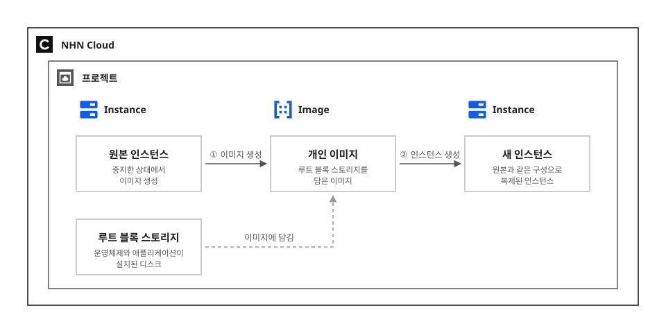

# Image로 인스턴스 복제하기

## 시작하기 전에

이미지는 운영체제와 애플리케이션을 담고 있으며 인스턴스의 루트 블록 스토리지를 생성하는 데 사용됩니다. Image는 이 이미지를 생성하고 관리하는 서비스로, NHN Cloud가 제공하는 공용 이미지를 그대로 쓰거나 운영 중인 인스턴스로 직접 이미지를 생성해 쓸 수 있습니다.

같은 구성의 서버가 여러 대 필요할 때마다 운영체제를 설치하고 패키지를 올리고 설정을 맞추는 일은 반복할수록 어긋나기 쉽습니다. 한 대를 원하는 상태로 만든 다음 이미지를 생성해 두면 그 상태가 그대로 복제되고, 큰 변경 작업을 앞두고 되돌아갈 지점을 남겨 둘 수도 있습니다.

여기에서는 사용 중인 인스턴스를 중지하고 이미지를 생성한 다음, 그 이미지로 새 인스턴스를 생성해 같은 구성이 복제되었는지 확인하는 방법을 살펴봅니다.

## 시나리오 환경 구성

- 이미지를 생성할 인스턴스가 필요합니다. 이 가이드는 Ubuntu 인스턴스를 기준으로 설명합니다.
- 이미지 생성 이후의 초기화 작업을 위해 인스턴스에 **최소 100KB의 여유 공간**이 필요합니다.
- Windows 인스턴스는 이미지를 생성하기 전에 **Sysprep으로 하드웨어와 사용자에 종속된 정보를 지우는 초기화 작업**이 필요하고, 초기화한 인스턴스를 중지한 다음 이미지를 생성합니다. 절차가 원본 이미지 버전에 따라 다르므로 [Windows Sysprep 가이드](https://docs.nhncloud.com/ko/Compute/Image/ko/console-guide/#guide-for-windows-sysprep)를 참고하세요. 중지한 Windows 인스턴스를 선택하면 이미지 생성 창에 **이미지로 생성되는 윈도우 비밀번호를 초기화합니다.** 항목이 나타납니다. Sysprep으로 초기화하면 비밀번호가 공백이 되므로 이 항목을 선택하세요. 이 가이드는 Linux 기준으로 진행합니다.

## 이미지 생성하기

1. NHN Cloud 콘솔에서 **Compute > Instance**를 클릭하세요.

2. 이미지를 생성할 인스턴스를 선택한 다음 목록 상단의 **더 보기(...)** 를 클릭하고 **인스턴스 중지**를 클릭하세요. **상태** 열의 아이콘이 회색으로 바뀌고, 아이콘에 마우스 포인터를 올리면 `SHUTOFF`가 나타납니다.

    > [!NOTE]
    > 인스턴스를 중지하지 않고도 이미지를 생성할 수 있지만 데이터 정합성은 보장되지 않습니다. 구동 중인 인스턴스를 선택하면 이미지 생성 창에 파일 시스템 무결성을 보장하지 않는다는 안내와 동의 체크박스가 표시되고, 체크박스를 선택해야 진행할 수 있습니다. `u2` 타입 인스턴스는 중지 상태에서만 이미지를 생성할 수 있습니다.

3. 인스턴스가 선택된 상태에서 **이미지 생성**을 클릭하세요.

    > [!NOTE]
    > **Compute > Image**에서 **이미지 생성**을 클릭해도 같은 대화 상자가 열립니다. 이때는 **인스턴스**의 **찾아보기**로 대상 인스턴스를 선택합니다.

4. **이미지 이름**에 이름을 입력하세요. 255자까지 입력할 수 있습니다.

5. **삭제 보호**는 기본값인 **사용 안 함**으로 둡니다. 실수로 삭제되면 안 되는 이미지라면 **사용**을 선택합니다.

6. **확인**을 클릭하세요.

7. **Compute > Image**를 클릭하세요. 만든 이미지가 목록에 나타납니다.

8. **상태** 열을 확인하세요. 이미지 생성이 완료되면 초록색 아이콘이 표시되며, 아이콘에 마우스 포인터를 올리면 `ACTIVE`가 나타납니다.

    > [!NOTE]
    > 이미지 생성에 걸리는 시간은 루트 블록 스토리지의 사용량에 따라 다릅니다. 수십 GB 규모는 몇 분, 수백 GB 규모는 몇 시간이 걸릴 수 있습니다. 상태가 오래 바뀌지 않는다면 **고객지원 > 문의하기**로 문의하세요.

9. 이미지 생성이 완료되면 **Compute > Instance**로 돌아가 원본 인스턴스를 선택하고 **더 보기(...)** 를 클릭한 다음 **인스턴스 시작**을 클릭하세요. 이미지 생성 중에는 인스턴스 시작 기능이 제한되므로 상태가 `ACTIVE`로 바뀐 뒤에 시작하세요.

## 만든 이미지로 인스턴스 생성하기

1. **Compute > Instance**에서 **인스턴스 생성**을 클릭하세요.

2. **인스턴스 템플릿**은 기본값인 **사용 안 함**, **OS 설정**은 기본값인 **신규 생성 및 설정**으로 둡니다.

3. 이미지 목록에서 **개인 이미지** 탭을 클릭한 다음 만든 이미지를 선택하세요. **루트 블록 스토리지**의 크기가 이미지의 최소 블록 스토리지에 맞춰 자동으로 설정됩니다. **블록 스토리지 타입**과 **삭제 정책**은 기본값을 그대로 둡니다.

4. **인스턴스 이름**을 입력하고 **인스턴스 타입**, **키페어**를 선택하세요. **가용성 영역**, **배치 정책**, **인스턴스 수** 등 나머지 항목은 기본값을 그대로 둡니다.

5. **네트워크 설정**은 기본값인 **네트워크 인터페이스 생성**으로 두고, **네트워크**에서 원본 인스턴스와 같은 서브넷을 선택하세요. **보안 그룹**은 원본 인스턴스에 적용된 그룹을 선택하세요. 같은 네트워크 조건에서 접속해 복제 결과를 확인하기 위해서입니다. **플로팅 IP**와 **추가 설정**의 항목은 기본값을 그대로 둡니다.

    > [!NOTE]
    > 원본 인스턴스의 네트워크 설정과 보안 그룹은 이미지에 담기지 않습니다. 새 인스턴스에서 다시 지정해야 합니다.

6. 인스턴스 생성에 필요한 설정 값을 모두 입력했다면 **인스턴스 생성**을 클릭하세요. 생성에는 몇 분 정도 소요될 수 있습니다.

7. **상태** 열의 아이콘이 초록색이 되면 생성이 완료된 것입니다. 생성된 인스턴스를 클릭해 상세 정보를 확인하세요. **이미지 이름**에 방금 만든 이미지가 표시되면 그 이미지로 생성된 것입니다.

    > [!NOTE]
    > 플로팅 IP를 연결하지 않아도 **로그 보기**나 **스크린숏 보기**로 부팅 상태를 확인할 수 있습니다. 접속해서 확인하려면 플로팅 IP를 연결하고 보안 그룹에서 SSH(22번 포트) 접속을 허용하세요.

## 응용하기

- **다른 리전에서 사용**: 이미지를 선택한 다음 **다른 리전으로 복제**를 클릭하고 **리전**을 선택하면 같은 이미지가 그 리전에 복사됩니다. 재해 복구 환경을 다른 리전에 갖춰 두거나 리전을 옮겨 서비스를 재구성할 때 사용합니다. 자세한 내용은 [Image 콘솔 사용 가이드의 다른 리전으로 복제](https://docs.nhncloud.com/ko/Compute/Image/ko/console-guide/#copy-to-another-region)를 참고하세요.
- **다른 프로젝트와 공유**: **다른 프로젝트로 공유**를 클릭하면 조직의 프로젝트 목록이 나타납니다. 공유할 프로젝트를 선택한 다음 **공유**를 클릭하면 그 프로젝트에서도 이 이미지로 인스턴스를 생성할 수 있습니다. 개발과 운영 프로젝트가 나뉘어 있을 때 같은 구성을 옮기는 데 활용할 수 있습니다. 공유받은 이미지는 다시 공유할 수 없습니다. 자세한 내용은 [Image 콘솔 사용 가이드의 다른 프로젝트에 공유](https://docs.nhncloud.com/ko/Compute/Image/ko/console-guide/#share-with-other-projects)를 참고하세요.
- **생성 화면의 개인 이미지 탭에 이미지가 보이지 않을 때**: 인스턴스, 인스턴스 템플릿, NKS 등 각 서비스의 생성 화면에는 이미지의 **사용 대상 서비스** 속성에 포함된 서비스에서만 이미지가 나타납니다. **Compute > Image**의 이미지 목록에서 이미지를 선택하고 **수정**을 클릭해 값을 확인하세요.
- **추가 블록 스토리지의 데이터 보관**: 이미지는 루트 블록 스토리지만 담으므로 인스턴스에 추가로 연결한 블록 스토리지의 데이터는 이미지로 복제되지 않습니다. 그 데이터도 남겨야 한다면 **Storage > Block Storage**에서 해당 블록 스토리지의 **스냅숏 생성**으로 읽기 전용 복사본을 만들고, 새 인스턴스에는 그 스냅숏으로 생성한 블록 스토리지를 연결합니다. 데이터 정합성을 보장하려면 인스턴스에서 연결을 해제한 뒤 스냅숏을 생성하기를 권장합니다. 자세한 내용은 [Block Storage 콘솔 사용 가이드의 스냅숏 생성](https://docs.nhncloud.com/ko/Storage/Block%20Storage/ko/console-guide/#create-snapshots)을 참고하세요.
- **외부에서 만든 이미지 가져오기**: 다른 환경에서 만든 이미지 파일은 콘솔로 올릴 수 없고 Image API로만 등록할 수 있습니다. 자세한 내용은 [Image API 가이드](https://docs.nhncloud.com/ko/Compute/Image/ko/public-api/)를 참고하세요.

## 정리하기

실습으로 만든 리소스는 사용을 마치면 삭제하세요. 인스턴스는 생성한 시점부터 과금됩니다.

1. **Compute > Instance**에서 만든 인스턴스를 선택한 다음 목록 상단의 **더 보기(...)** 를 클릭하고 **인스턴스 삭제**를 클릭하세요.

2. **Compute > Image**에서 만든 이미지를 선택한 다음 **삭제**를 클릭하세요.

    > [!WARNING]
    > 이미지를 삭제하면 복구할 수 없습니다. 삭제 보호를 **사용**으로 설정했다면 **삭제 보호 설정 변경**으로 먼저 해제해야 합니다.

## 용어 정리

| 용어 | 설명 |
| --- | --- |
| 이미지 | 애플리케이션을 실행하기 위해 필요한 모든 소프트웨어 및 설정이 패키징된 가상 디스크 |
| 개인 이미지 | 공용 이미지를 토대로 사용자가 자신이 원하는 구성으로 생성한 이미지 |
| 인스턴스 | 가상의 CPU, 메모리, 기본 디스크로 구성된 가상 서버 |
| 블록 스토리지 | 데이터를 블록 단위로 나눠서 저장하는 블록 수준 데이터 스토리지로, 인스턴스 기본 디스크 외에 추가로 연결하여 사용할 수 있음 |
| 스냅숏 | 특정 시점의 스토리지 데이터를 저장하고, 장애나 데이터 손상 시 해당 시점의 데이터를 원하는 서버로 복구할 수 있는 기능 |
