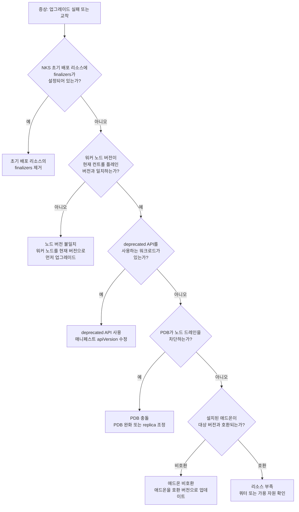

# NHN Kubernetes Service(NKS) 클러스터 버전 업그레이드가 실패할 때

## 증상

NHN Kubernetes Service(NKS) 콘솔에서 Kubernetes 클러스터의 버전 업그레이드를 실행했으나, 업그레이드가 도중에 실패하거나 진행 중 상태에서 멈춥니다. 클러스터가 비정상 상태에 놓여 노드와 워크로드를 관리할 수 없게 됩니다. NKS 콘솔의 클러스터 목록에서 **작업 상태** 칼럼에 로딩 표시가 계속 남아 있거나 오류 상태가 표시됩니다.
<!-- 🔍 검증 필요: 업그레이드 실패 시 작업 상태 칼럼에 표시되는 정확한 오류 상태명 -->

다음과 같은 현상이 나타날 수 있습니다.

- 클러스터 목록의 **작업 상태**가 정상(초록색)으로 돌아오지 않음
- 워커 노드 일부가 준비되지 않은 상태로 전환됨
- 기존 워크로드의 파드(pod)가 재시작되거나 대기 상태로 남음

## 빠른 확인

클러스터 업그레이드 실패는 원인이 다양하므로, 빠른 확인만으로 해결되기 어렵습니다. 다만, 다음을 먼저 점검하면 원인을 빠르게 좁힐 수 있습니다.

1. NKS 콘솔에서 클러스터를 선택한 뒤 하단의 **이벤트** 탭을 확인합니다. 업그레이드 관련 이벤트의 **상태**와 **상세 정보**에서 실패 원인의 단서를 찾을 수 있습니다.

2. 클러스터 기본 정보의 K8s 버전 옆 **업그레이드** 버튼이 비활성화되어 있다면, 워커 노드 버전이 컨트롤 플레인과 일치하지 않는 상태입니다. **워커 노드 버전이 컨트롤 플레인과 불일치할 때**를 확인하세요.

3. kubectl로 클러스터에 접근할 수 있다면, 노드 버전과 이벤트를 직접 확인할 수도 있습니다.

    ```sh
    kubectl get nodes -o wide
    kubectl get events --sort-by=.lastTimestamp -A
    ```

## 원인과 해결 방법

NKS 클러스터 업그레이드는 마스터 구성 요소(컨트롤 플레인) 업그레이드 → 워커 노드 업그레이드 순서로 진행됩니다.
<!-- 🔍 검증 필요: NKS 업그레이드가 실제로 이 순서로 진행되는지 NKS 개발 조직에 확인 --> NKS 콘솔에서 업그레이드 모달의 제목도 "클러스터 업그레이드 (마스터 구성 요소)"로 표시됩니다. 각 단계에서 다음과 같은 원인으로 실패할 수 있습니다.



> 📐 **다이어그램 청사진**
> 위 Mermaid 코드는 작성자가 사내 디자인 규격에 맞게 그릴 때 참고할 청사진입니다. 게시 시에는 이 코드 블록과 안내 어드모니션을 삭제하고 작성자가 그린 이미지로 교체합니다.

### NKS 초기 배포 리소스에 finalizers가 설정되어 있을 때

#### 원인

NKS는 클러스터 생성 시 calico, coredns 등의 리소스를 자동으로 배포합니다. 모든 워커 노드 그룹의 업그레이드가 완료되면 이 초기 배포 리소스가 재배포되는데, 해당 리소스에 `finalizers`가 설정되어 있으면 리소스 삭제가 차단되어 재배포에 실패하고 업그레이드가 중단됩니다.

#### 해결 방법

업그레이드 전에 NKS 초기 배포 리소스의 `finalizers` 설정을 제거합니다.

1. 다음 명령으로 초기 배포 리소스의 `finalizers`를 제거합니다.

    ```sh
    kubectl patch {리소스 유형} {리소스 이름} -n {네임스페이스} --type=json -p='[{"op": "remove", "path": "/metadata/finalizers"}]'
    ```

    예를 들어, `calico-kube-controllers` ClusterRole에 `finalizers`가 설정된 경우:

    ```sh
    kubectl patch clusterrole calico-kube-controllers --type=json -p='[{"op": "remove", "path": "/metadata/finalizers"}]'
    ```

2. 모든 초기 배포 리소스에서 `finalizers`를 제거한 뒤 클러스터 업그레이드를 시도합니다.

### 워커 노드 버전이 컨트롤 플레인과 불일치할 때

#### 원인

Kubernetes는 컨트롤 플레인과 워커 노드 사이의 버전 차이(skew)를 일정 범위 내에서만 허용합니다. NKS에서는 한 번에 한 마이너 버전만 업그레이드할 수 있습니다(예: v1.32 → v1.33). 워커 노드의 kubelet 버전이 현재 컨트롤 플레인 버전보다 낮으면, 컨트롤 플레인을 다음 버전으로 올릴 때 허용 범위를 초과하게 됩니다. 이 경우 NKS 콘솔에서 클러스터 기본 정보의 K8s 버전 **업그레이드** 버튼이 비활성화되어 업그레이드를 진행할 수 없습니다.

#### 해결 방법

워커 노드를 현재 컨트롤 플레인 버전과 일치시킨 뒤 클러스터 업그레이드를 다시 시도합니다.

1. 노드 버전을 확인합니다.

    ```sh
    kubectl get nodes -o wide
    ```

2. 컨트롤 플레인 버전보다 낮은 워커 노드가 있으면, NKS 콘솔에서 해당 노드 그룹의 버전을 현재 컨트롤 플레인 버전으로 먼저 업그레이드합니다. 클러스터 목록에서 **노드 그룹 보기**를 클릭한 뒤, 노드 그룹의 **기본 정보** 탭에서 버전 항목 옆의 **업그레이드** 버튼을 클릭합니다.

3. 모든 노드의 버전이 일치하면 클러스터 업그레이드를 다시 시도합니다.

> **💡 알아두기**
> Kubernetes는 마이너 버전을 한 단계씩 올리는 것을 권장합니다. 예를 들어 1.25에서 1.27로 올리려면, 1.25 → 1.26 → 1.27 순서로 두 번 업그레이드해야 합니다.

### deprecated API를 사용하는 워크로드가 있을 때

#### 원인

Kubernetes는 버전이 올라갈 때마다 일부 API를 제거(remove)합니다. 예를 들어, `extensions/v1beta1`의 Ingress는 1.22 버전에서 제거되었습니다. 업그레이드 대상 버전에서 제거된 API를 사용하는 매니페스트(manifest)가 클러스터에 남아 있으면, 해당 리소스를 처리할 수 없어 업그레이드가 실패합니다.

#### 해결 방법

업그레이드 대상 버전에서 제거되는 API를 사용하는 워크로드를 찾아 매니페스트의 `apiVersion`을 수정합니다.

1. 클러스터에서 deprecated API 호출 여부를 확인합니다. API 서버(API server) 메트릭에서 deprecated API 호출 기록을 조회할 수 있습니다.

    ```sh
    kubectl get --raw /metrics | grep apiserver_requested_deprecated_apis
    ```
    <!-- 🔍 검증 필요: NKS에서 이 메트릭을 직접 조회할 수 있는지, 또는 별도의 deprecated API 사전 검사 기능이 있는지 -->

2. deprecated API를 사용하는 리소스를 찾았다면, 해당 매니페스트 파일의 `apiVersion`을 새 버전에서 지원하는 API 그룹으로 변경합니다.

    자주 변경되는 API 예시:

    | 기존 apiVersion | 대체 apiVersion | 제거된 버전 |
    |---|---|---|
    | `extensions/v1beta1` (Ingress) | `networking.k8s.io/v1` | 1.22 |
    | `policy/v1beta1` (PodDisruptionBudget) | `policy/v1` | 1.25 |
    | `autoscaling/v2beta1` | `autoscaling/v2` | 1.26 |
    <!-- 🔍 검증 필요: NKS에서 현재 지원하는 Kubernetes 버전 범위에 맞게 이 표를 조정해야 할 수 있음 -->

3. 수정한 매니페스트를 적용합니다.

    ```sh
    kubectl apply -f <수정한-매니페스트-파일>
    ```

4. deprecated API 호출이 더 이상 나타나지 않으면 클러스터 업그레이드를 다시 시도합니다.

### PodDisruptionBudget(PDB)이 노드 드레인을 차단할 때

#### 원인

PodDisruptionBudget(PDB)은 파드의 최소 가용 수를 보장하는 Kubernetes 리소스입니다. 업그레이드 과정에서 워커 노드를 드레인(drain)할 때, PDB 조건을 충족하지 못하면 파드를 퇴거(eviction)할 수 없어 업그레이드가 교착 상태에 빠집니다. 특히 `minAvailable`이 전체 replica 수와 같거나, replica가 1개인 디플로이먼트(deployment)에 PDB가 설정된 경우에 자주 발생합니다.

#### 해결 방법

PDB 조건을 일시적으로 완화한 뒤 업그레이드를 진행합니다.

1. 모든 네임스페이스(namespace)의 PDB를 확인합니다.

    ```sh
    kubectl get pdb -A
    ```

2. `ALLOWED DISRUPTIONS`가 `0`인 PDB를 찾습니다. 이 PDB가 드레인을 차단하는 원인일 가능성이 높습니다.

3. 해당 디플로이먼트의 replica 수를 PDB의 `minAvailable` 값보다 충분히 높게 조정합니다. 예를 들어, `minAvailable: 1`이고 현재 replica가 1이면, replica를 2 이상으로 늘려 한 파드가 퇴거되어도 PDB 조건을 충족할 수 있게 합니다.

    ```sh
    kubectl scale deployment <디플로이먼트-이름> --replicas=2 -n <네임스페이스>
    ```

4. 또는 업그레이드 기간 동안 PDB의 `minAvailable` 값을 낮추거나 PDB를 일시 삭제합니다.

    ```sh
    kubectl delete pdb <PDB-이름> -n <네임스페이스>
    ```

> **⚠️ 주의**
> PDB를 삭제하거나 완화하면 업그레이드 중 해당 서비스의 가용성이 일시적으로 저하될 수 있습니다. 운영 환경에서는 트래픽이 적은 시간대에 작업하세요.

5. 업그레이드가 완료되면 PDB와 replica 설정을 원래대로 복원합니다.

### 설치된 애드온이 새 Kubernetes 버전과 비호환일 때

#### 원인

Ingress Controller, CSI 드라이버, 모니터링 에이전트 등 클러스터에 별도로 설치한 애드온이 업그레이드 대상 Kubernetes 버전을 지원하지 않으면 업그레이드가 실패할 수 있습니다.
<!-- 🔍 검증 필요: NKS 업그레이드 시 애드온 비호환이 실제로 업그레이드를 차단하는지, 또는 NKS가 자체적으로 애드온 호환성을 검사하는지 --> 애드온이 사용하는 API가 새 버전에서 제거되었거나, 애드온의 호환 버전 범위에 대상 Kubernetes 버전이 포함되지 않는 경우가 이에 해당합니다.

#### 해결 방법

클러스터에 설치된 애드온을 대상 Kubernetes 버전과 호환되는 버전으로 먼저 업데이트합니다.

1. 클러스터에 설치된 Helm 차트와 오퍼레이터를 확인합니다.

    ```sh
    helm list -A
    ```
    <!-- 🔍 검증 필요: NKS 클러스터에서 Helm CLI 사용이 가능한지 -->

2. 각 애드온의 공식 문서에서 대상 Kubernetes 버전과의 호환성을 확인합니다. 주요 확인 대상:

    | 애드온 유형 | 확인 사항 |
    |---|---|
    | Ingress Controller | 대상 K8s 버전과의 호환 매트릭스 |
    | CSI 드라이버 | 대상 K8s 버전 지원 여부 |
    | 모니터링 에이전트 | API 호환성, CRD 버전 |
    | 서비스 메시(service mesh) | 대상 K8s 버전 지원 여부 |

3. 비호환 애드온을 호환 버전으로 업데이트합니다.

    ```sh
    helm upgrade <릴리스-이름> <차트> --version <호환-버전> -n <네임스페이스>
    ```

4. 모든 애드온이 호환 버전으로 업데이트되면 클러스터 업그레이드를 다시 시도합니다.

### 업그레이드에 필요한 리소스가 부족할 때

#### 원인

업그레이드 방식에 따라 추가 노드를 생성해야 할 수 있습니다. 이때 프로젝트의 Compute 쿼터가 부족하거나, 해당 가용성 영역(availability zone)에 할당 가능한 자원이 없으면 노드 생성이 실패하여 업그레이드가 중단됩니다.
<!-- 🔍 검증 필요: NKS 업그레이드 시 서지(surge) 방식으로 추가 노드를 생성하는지 -->

#### 해결 방법

프로젝트의 Compute 쿼터를 확인하고 여유를 확보한 뒤 업그레이드를 재시도합니다.

1. NHN Cloud 콘솔의 프로젝트 대시보드에서 **쿼터 관리** 탭을 클릭해 현재 쿼터 사용량을 확인합니다.

2. 쿼터가 부족하면 다음 방법으로 여유를 확보합니다.
    - 사용하지 않는 인스턴스나 노드를 삭제합니다.
    - 쿼터 상향이 필요하면 NHN Cloud 콘솔의 **쿼터 관리** 탭에서 쿼터 상향을 요청합니다.

3. 리소스가 확보되면 클러스터 업그레이드를 다시 시도합니다.

## 문의하기

위 방법으로 해결되지 않으면 NHN Cloud 고객지원에 문의하세요. 문의 시 다음 정보를 함께 전달하면 빠른 진단에 도움이 됩니다.

- 업그레이드 실패가 발생한 정확한 시각(KST 기준)
- 클러스터 이름과 UUID (NHN Kubernetes Service(NKS) 콘솔에서 클러스터를 선택한 뒤 **기본 정보** 탭의 클러스터 이름 아래에서 확인할 수 있습니다)
- 업그레이드 전 Kubernetes 버전과 대상 버전
- 클러스터 이벤트 로그(`kubectl get events --sort-by=.lastTimestamp -A`의 출력)
- 노드 상태(`kubectl get nodes -o wide`의 출력)
- NHN Kubernetes Service(NKS) 콘솔의 **이벤트** 탭 화면 캡처 (클러스터 선택 후 하단의 **이벤트** 탭에서 확인)

## 문제 예방하기

업그레이드 실패를 사전에 방지하려면 다음을 권장합니다.

- **업그레이드 전 deprecated API 점검을 습관화하세요.** 업그레이드 전에 `kubectl get --raw /metrics | grep apiserver_requested_deprecated_apis`를 실행하거나, [Kubernetes Deprecated API Migration Guide](https://kubernetes.io/docs/reference/using-api/deprecation-guide/)를 참고해 대상 버전에서 제거되는 API를 미리 확인합니다. 이 점검을 CI/CD 파이프라인에 포함하면 새 매니페스트 배포 시 자동으로 확인할 수 있습니다.
- **PDB 설정을 점검하세요.** replica가 1개인 디플로이먼트에 `minAvailable: 1`인 PDB가 설정되어 있으면, 업그레이드 시 반드시 교착이 발생합니다. PDB의 `minAvailable`은 항상 전체 replica 수보다 작게 설정하세요.
- **애드온 호환 매트릭스를 미리 확인하세요.** 클러스터에 설치한 Ingress Controller, CSI 드라이버 등 주요 애드온의 Kubernetes 버전 호환 매트릭스를 업그레이드 전에 확인하고, 필요하면 먼저 업데이트합니다.
- **비운영 클러스터에서 먼저 테스트하세요.** 운영 클러스터를 업그레이드하기 전에 동일 구성의 비운영(staging) 클러스터에서 업그레이드를 먼저 시도하면, 예상치 못한 문제를 사전에 발견할 수 있습니다.

## 용어 정리

| 용어 | 설명 |
|---|---|
| Kubernetes 클러스터 | 노드의 집합. 노드는 마스터와 연결되어 동작하므로 Kubernetes 클러스터는 마스터와 노드로 구성됨. 모든 클러스터는 한 개 이상의 노드를 가지며, Kubernetes가 제공하는 기능은 클러스터 단위로 동작하고 설정할 수 있음 |
| 컨트롤 플레인 | Kubernetes 클러스터의 제어를 담당하는 주요 노드로 클러스터 상태를 관리하고 파드(pod)의 스케줄링을 담당 |
| 워커 노드 | Kubernetes 클러스터 내에서 컨테이너가 실행되는 물리 또는 가상 머신. 노드는 클러스터의 구성원으로서 컨테이너를 실행하고 관리 |
| 파드 | Kubernetes에서 가장 작은 배포 단위이며 하나 이상의 컨테이너로 구성. 동일한 파드 내의 컨테이너는 동일한 네트워크 네임스페이스와 IP 주소를 공유 |
| 매니페스트 | Kubernetes 클러스터에서 실행되는 리소스를 정의하는 YAML 또는 JSON 형식의 파일 |
| 워크로드 | 주어진 시간 안에 처리해야 할 컴퓨팅 작업 또는 해당 작업에 필요한 컴퓨팅, 스토리지, 메모리 및 네트워크 리소스. 클라우드 환경에서는 가상 머신, 데이터베이스, 애플리케이션, 노드 등을 포함하여 클라우드 리소스를 사용하는 모든 서비스 또는 기능을 의미 |
| API 서버 | Kubernetes 클러스터의 중심 컴포넌트이며, 사용자와 클러스터의 다른 부분 및 모든 외부 컴포넌트 간의 상호 작용을 가능하게 하는 역할 |
| 가용성 영역 | 독립된 전원 및 네트워크를 갖춘 데이터 센터로, 인스턴스가 만들어지는 물리적인 위치 |

